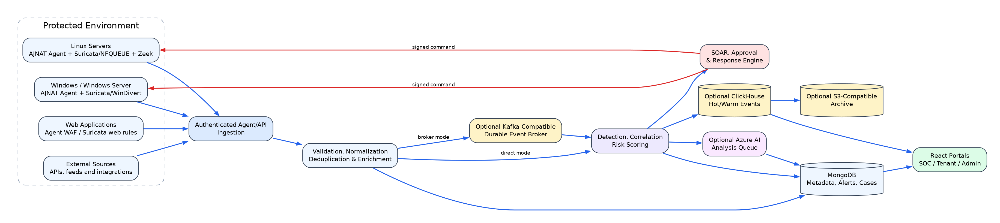
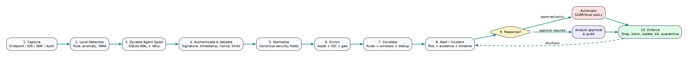
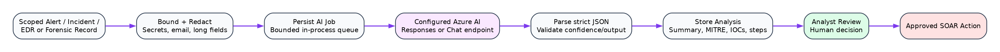
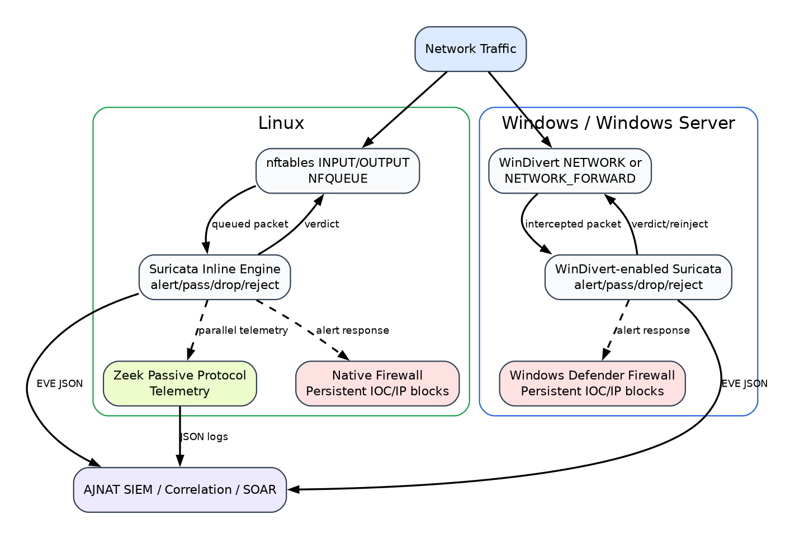
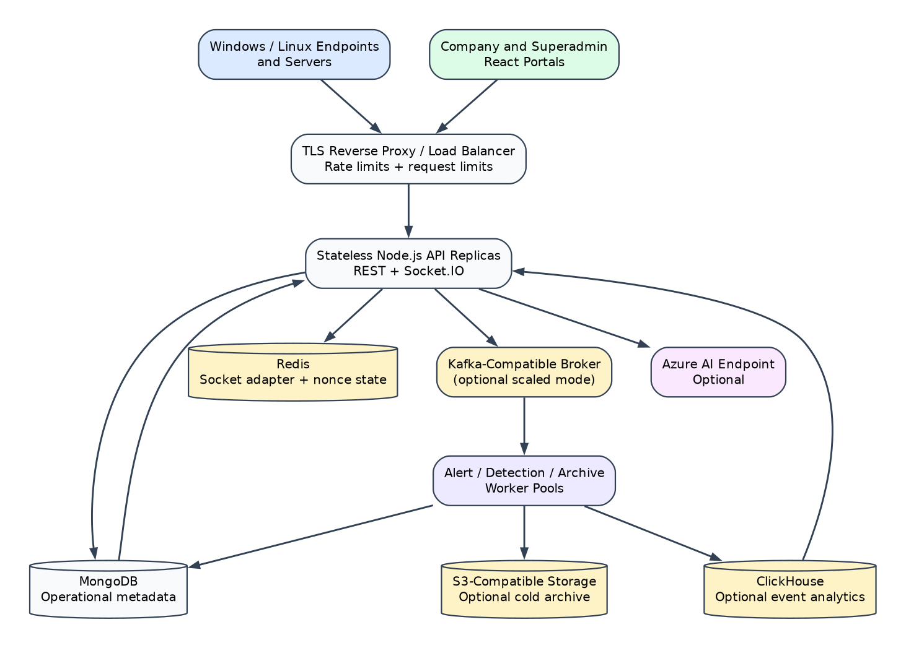

# AI-Powered Threat Detection and Incident Response (SOC) Platform

## Product & Technical Documentation

**Product:** AJNAT SOC / AJNAT EDR  
**Company:** AJNAT Cybersecurity Technologies Ltd. *  
**Document version:** 1.0  
**Date of preparation:** 25 August 2026  
**Document owner:** Product, Engineering and Information Security  
**Classification:** Confidential and Proprietary

> *The legal company name must be confirmed by AJNAT management before external publication. This report describes capabilities evidenced in the product repository and distinguishes implemented functions from deployment-dependent, under-validation, and planned functions.*

---

## Confidentiality and proprietary notice

This document contains confidential technical, operational, and product information belonging to AJNAT. It is supplied only for authorized evaluation, deployment planning, customer due diligence, audit support, or internal use. No part may be copied, disclosed, reverse engineered, or distributed to another party without written authorization. Architecture diagrams are logical views and do not expose secrets, keys, customer data, or production network addresses.

This is a product and technical description, not a certification, penetration-test report, legal opinion, service-level agreement, or guarantee that every attack will be detected or prevented. Security outcomes depend on correct deployment, sensor coverage, rule quality, operating-system privileges, network topology, third-party services, and continuous operational tuning.

### Revision history

| Version | Date | Owner | Description |
|---|---|---|---|
| 1.0 | 25 August 2026 | Product, Engineering and Information Security | Initial evidence-based complete product and technical report |

### Capability status legend

| Status | Meaning |
|---|---|
| **Implemented** | Code and product workflow exist in the present repository. Production use still requires deployment acceptance testing. |
| **Deployment-dependent** | Implemented integration requires external infrastructure, credentials, licensed feed, compatible binary, network position, or administrator configuration. |
| **Under validation** | Function exists but requires broader performance, compatibility, adversarial, or production-scale validation. |
| **Planned** | Target capability; it must not be represented as available today. |

### Table of contents

1. Document Information  
2. Executive Summary  
3. Problem Statement  
4. Solution Overview  
5. Product Architecture  
6. Core Platform Components  
7. Cyber Attack Detection & Prevention  
8. Security Dashboards & Reporting  
9. User & Access Management  
10. Use Cases  
11. Product Limitations & Current Status  
12. Security & Data Protection  
13. Compliance & Standards

# 1. Document Information

## 1.1 Purpose and intended audience

This document explains the product value, technical design, security functions, deployment model, operational limitations, and standards alignment of the AJNAT AI-Powered Threat Detection and Incident Response platform. It is intended for CISOs, SOC managers, security architects, IT administrators, incident responders, auditors, implementation partners, procurement teams, and authorized customers.

The document can support product evaluation and solution design, but a deployment-specific statement of work must define exact sources, retention, integrations, high availability, recovery objectives, service levels, data residency, and acceptance criteria.

## 1.2 Product identity

AJNAT SOC is a unified security operations platform. AJNAT EDR is its endpoint collection, detection, and response capability. Together, they combine SIEM, SOAR, endpoint telemetry, network IDS/IPS, host firewall control, WAF monitoring, threat intelligence, AI-assisted analysis, anomaly detection, case management, dashboards, and audit evidence.

## 1.3 Evidence and terminology

The descriptions in this report were checked against current architecture, implementation evidence, backend services, endpoint-agent modules, platform routes, models, and operational documentation. “AI” means a configured external Azure AI model used through controlled backend workflows; it does not mean that every decision is autonomous. “IPS” means actual prevention only where a traffic-verdict or firewall enforcement path is verified. An alert alone is IDS, not IPS.

All dates, organization names, certification references, performance values, and screenshots should be reconfirmed during release approval. Customer-specific configuration and test results supersede general statements in this report.

# 2. Executive Summary

## 2.1 Company and platform purpose

AJNAT develops cybersecurity technology intended to help organizations operate a consolidated Security Operations Center without assembling a large number of disconnected products. The platform’s purpose is to collect security telemetry, turn raw events into prioritized alerts and incidents, assist investigation, and execute governed response actions from a central control plane.

AJNAT SOC combines host, network, web, identity, and threat-intelligence context. Endpoint agents collect process, file, network, registry, and security observations. Network sensors such as Suricata and Zeek add packet and protocol visibility. The backend validates, normalizes, enriches, correlates, stores, and exposes these records to tenant-scoped portals. SOAR policies can initiate containment automatically or request analyst approval. AI can summarize evidence and recommend next steps, while deterministic controls retain authority over enforcement.

## 2.2 Key cybersecurity capabilities

- Centralized SIEM ingestion, normalization, alerting, search, investigation, and case context.
- SOAR rules and playbooks with automatic, manual, and approval-required modes.
- User-space EDR telemetry for Windows and Linux, with response commands such as process termination, quarantine, IP blocking, and endpoint isolation when privileges and policy allow.
- Linux inline Suricata IPS through nftables/NFQUEUE, with Zeek as a passive protocol sensor.
- Windows Suricata packet IDS through Npcap; real inline Windows IPS only with a compatible, verified Suricata build using WinDivert. Defender Firewall can enforce longer-lived blocks.
- Host firewall policy and event collection across supported operating systems.
- Agent WAF detection for common web attacks, with interception/blocking when the reverse-proxy or enforcement mode is explicitly deployed.
- IOC enrichment using configured commercial and public intelligence providers.
- Azure AI-assisted alert explanation, incident summarization, prioritization, MITRE mapping, IOC extraction, investigation guidance, and recommended response.
- Behavioral and heuristic anomaly signals for endpoints, networks, authentication, and event patterns, with maturity varying by detector.
- Multi-tenant portals, role-based access, MFA capability, audit records, reports, and real-time updates.
- AES-256-GCM authenticated encryption for supported sensitive agent-local data and SOAR connector credentials; production transport uses TLS 1.2/1.3 with an approved AES-256-GCM cipher policy where platform compatibility permits.

## 2.3 Target organizations and sectors

The platform is relevant to mid-market and enterprise organizations, managed security service providers, government and public-sector environments, financial services, healthcare, education, technology/SaaS, manufacturing, retail, and critical-service operators. It is particularly useful where security teams need consolidated visibility and repeatable response but have limited analyst capacity.

## 2.4 Benefits

The principal benefit is reduction of operational fragmentation. A single incident can contain endpoint process evidence, network detection, web request indicators, threat reputation, AI explanation, and response history. This reduces console switching and supports consistent triage. Automation shortens time to containment for approved scenarios, while approval gates reduce the risk of unsafe autonomous actions. Tenant and role scoping support delegated operations. Durable agent spooling and optional broker/storage tiers improve resilience when components are temporarily unavailable.

## 2.5 Monitoring and response approach

AJNAT uses defense in depth:

1. **Observe:** collect endpoint, network, web, identity, application, and infrastructure events.
2. **Validate:** authenticate the source, check integrity and freshness, normalize fields, and remove duplicates.
3. **Detect:** apply signatures, heuristics, thresholds, correlations, reputation, and anomaly logic.
4. **Contextualize:** associate tenant, asset, user, process, IOC, and prior-event context.
5. **Prioritize:** calculate severity and risk; optionally request AI analysis.
6. **Respond:** notify, open an incident, block an IOC, terminate or quarantine an artifact, isolate a host, or run an approved playbook.
7. **Verify and learn:** track action status, preserve audit evidence, tune rules, and report outcomes.

The platform is designed for human-governed automation. Destructive or business-impacting steps should require explicit policy and, where appropriate, approval.

# 3. Problem Statement

## 3.1 Current cybersecurity challenges

Organizations must protect endpoints, servers, cloud workloads, web applications, identities, and networks while adversaries use multi-stage techniques. A phishing payload may create a process, change persistence settings, contact a command-and-control host, steal credentials, and move laterally. Each stage can appear in a different tool, at a different time, with different field names.

Security teams also face encrypted traffic, remote work, short-lived infrastructure, supply-chain risk, credential abuse, and rapid vulnerability exploitation. Detection therefore requires both broad telemetry and the ability to connect weak signals into a defensible narrative.

## 3.2 Fragmented tools and inconsistent data

Point products commonly maintain separate consoles, permissions, severity scales, retention rules, and incident identifiers. Analysts manually copy IP addresses, hashes, hostnames, and users between them. Duplicate detections obscure the true sequence of events. Inconsistent timestamps and schemas make searches unreliable. Integration projects then become permanent engineering work rather than security improvement.

## 3.3 High alert volume and alert fatigue

Signature sensors and endpoint products can generate many low-context events. Without deduplication, suppression, correlation, asset criticality, and reputation, analysts spend time reviewing harmless repetition. Repeated false positives lower confidence and create the risk that a genuine attack is missed. A platform must preserve raw evidence while presenting an actionable, ranked work queue.

## 3.4 Manual investigation and delayed response

A manual investigation may require process-tree review, file-hash reputation, user authentication history, destination ownership, related alerts, and change records. Slow context gathering increases mean time to acknowledge and contain. After confirmation, responders may still need to sign into firewalls, endpoint consoles, identity providers, and ticket systems. Delay gives malware and credential attackers more time to spread.

## 3.5 Correlation difficulty

The same entity may be represented as an IP, hostname, agent identifier, cloud resource, user principal, or application session. NAT, DHCP, proxying, and shared accounts further complicate attribution. Useful correlation needs normalized timestamps, tenant boundaries, entity resolution, time-window rules, and clear confidence. A simple text match is insufficient for high-impact automated response.

## 3.6 Limited SOC resources

Smaller teams may not have 24×7 Tier 1 coverage, detection engineers, threat-intelligence specialists, and incident commanders. They need guided workflows, understandable alerts, reusable playbooks, safe defaults, and evidence-rich reporting. They also need explicit health indicators because an apparently quiet dashboard can mean either “no attack” or “sensor unavailable.”

## 3.7 Requirements derived from the problem

| Operational problem | Platform requirement | Intended outcome |
|---|---|---|
| Disconnected telemetry | Unified, tenant-scoped ingestion and normalization | One investigation context |
| Duplicate/noisy alerts | Deduplication, thresholds, suppression and correlation | Lower analyst burden |
| Missing context | Asset, IOC, user and process enrichment | Faster triage |
| Slow containment | Policy-driven SOAR and agent commands | Reduced response delay |
| Unsafe automation | Approval gates, scope checks, rollback and audit | Controlled action |
| Limited expertise | AI explanation and recommended investigation | Analyst assistance |
| Sensor blind spots | Heartbeats, capability state and failure reporting | Honest coverage status |
| Regulatory evidence | Audit logs, incident history and retention policy | Better assurance support |

# 4. Solution Overview

## 4.1 Unified monitoring and centralized visibility

AJNAT establishes a central security control plane for telemetry from endpoint agents, Suricata, Zeek, web controls, firewall events, application/API sources, and threat feeds. Direct ingestion is supported for simpler deployments. A KafkaJS-compatible broker can be introduced for decoupling and scale. The browser portals provide SOC, tenant, administrative, and reporting views over scoped backend APIs and live Socket.IO updates.

Events receive common fields such as tenant, source, category, timestamp, severity, asset, user, source/destination address, process, indicator, and raw evidence reference. Normalization does not discard the original meaning; it makes cross-source filtering and correlation practical.

## 4.2 Detection, investigation and intelligence

Detection combines deterministic rules, Suricata signatures, WAF patterns, endpoint heuristics, IOC matches, rate/threshold logic, and multi-event correlation. Analysts can search alerts and supporting events, inspect affected systems, review related indicators, create or update incidents, and see response activity. Intelligence providers enrich IPs, domains, URLs, and hashes with reputation and feed context when API keys and connectivity are configured.

## 4.3 Automated response

SOAR rules map triggers to playbooks. Actions include firewall block/unblock, endpoint isolate/release, process termination, quarantine, account/session actions, notification, connector invocation, and record updates. Execution mode can be automatic, manual, or approval-required. Every remote response depends on a reachable, authenticated, sufficiently privileged target agent or external connector. Action success must be confirmed; sending a command is not equivalent to successful enforcement.

## 4.4 AI-assisted analysis

AI jobs are persisted and processed through a bounded backend queue. Scoped, redacted evidence is sent to a configured Azure AI Responses or Chat Completions endpoint. The result can include an incident summary, suspected root cause, confidence, relevant MITRE ATT&CK techniques, extracted IOCs, investigation steps, and recommended response. The recommendation is advisory. SOAR policy and human approval remain the enforcement boundary.

## 4.5 Anomaly detection

The product uses behavioral and heuristic signals such as unusual process/file activity, ransomware-like change rates, suspicious command lines, network scanning rates, uncommon destinations, repeated authentication failure, and deviations from observed patterns. Some signals are implemented as deterministic windows or heuristics; comprehensive UEBA with stable long-term entity baselines remains an evolving capability and requires adequate clean historical data.

## 4.6 Operational model

AJNAT supports a continuous loop: configure sources and policies; observe sensor health; triage prioritized alerts; investigate related evidence; execute or approve containment; document the incident; recover; tune detections; and report metrics. This loop helps avoid a purely reactive “alert inbox” model.

# 5. Product Architecture

This section intentionally uses diagrams as the primary explanation. Yellow components are optional or externally provisioned. “Inline” is shown only where the packet path and verdict mechanism are verifiable.

## 5.1 High-level architecture

**Figure 1 — High-level platform architecture.** Protected endpoints and applications send authenticated telemetry to validation and normalization. Events can flow directly to detection or through a compatible broker. MongoDB is the current operational store; ClickHouse and S3-compatible storage are optional event tiers. Detection can create AI jobs and SOAR actions. Portals consume tenant-scoped data.

## 5.2 Detailed technical architecture and major components

| Layer | Major components | Responsibility |
|---|---|---|
| Collection | Python endpoint agent, Android agent, Suricata, Zeek, WAF, firewall and API inputs | Observe and locally queue telemetry |
| Transport | TLS-protected HTTPS APIs, signed/gzipped batches, retry, encrypted SQLite spool, optional broker | Confidential, authentic and resilient delivery; production TLS policy uses approved AES-256-GCM suites where supported |
| Processing | Validation, normalization, deduplication, enrichment, rules, correlation, scoring | Convert records into security findings |
| Intelligence/AI | IOC providers, feed ingestion, Azure AI job queue | Reputation, context and advisory reasoning |
| Data | MongoDB; optional Redis, ClickHouse and S3-compatible archive | Operational state, cache, event analytics and retention |
| Response | SOAR engine, approvals, command channel, host/network controls | Governed containment and recovery |
| Experience | React portals, APIs, Socket.IO, dashboards and reports | Investigation, administration and evidence |

The backend is a Node.js/Express service with MongoDB models and Socket.IO. It can ingest directly or use an external Kafka-compatible broker. Redis, ClickHouse, object storage, Azure AI, and intelligence APIs require separately deployed and secured services. The endpoint agent is primarily Python and uses OS/platform interfaces plus optional third-party tools.

## 5.3 Data-flow and security event flow

**Figure 2 — Event lifecycle.** A source observation is captured, buffered, transmitted, validated, normalized, deduplicated, enriched, detected, correlated, and persisted. Findings become alerts or incidents. Policy determines whether the outcome is notification, approval, or automatic response. Command acknowledgement and verification close the response loop.

Key controls at each stage are:

1. **Capture:** source identity, timestamp, sensor state, least necessary payload.
2. **Local durability:** bounded queue/spool, retry and dead-letter handling.
3. **Transport:** TLS 1.2/1.3 with approved AES-256-GCM suites where supported, certificate validation, request signing, timestamp/nonce checking, and compression limits.
4. **Ingestion:** schema and tenant validation, size/rate controls, deduplication.
5. **Analysis:** deterministic rules first; enrichment and optional AI where useful.
6. **Storage:** tenant scoping, indexes, retention and protected backups.
7. **Response:** policy, approval, target validation, command authentication, result audit.

Failure is explicit: delayed batches remain in the durable spool; unavailable optional services must not silently become “safe”; and failed commands remain failed or pending rather than being recorded as successful.

## 5.4 Detection and response flow

Detection can begin from a single high-confidence signature or from correlated weak signals. A Suricata signature, for example, is normalized with flow fields and rule metadata. It can be enriched with IP reputation and associated with endpoint connections. Correlation may raise severity when a suspicious destination is contacted by an unusual process. A SOAR rule then chooses notify-only, approval-required block, or automatic containment according to tenant policy.

The response engine records requested action, initiator, policy, target, approval state, command ID, dispatch time, acknowledgement, result, error detail, and reversal where supported. Analysts can distinguish an alert, a decision to respond, a dispatched command, and confirmed enforcement.

## 5.5 AI analysis flow

**Figure 3 — Governed AI assistance.** Selected alerts and incident evidence are scoped to the tenant, minimized and redacted, then queued. The configured Azure AI service returns structured assistance. Output is validated, stored, and presented to an analyst. It can propose a SOAR playbook but cannot bypass the response policy.

AI safety and quality controls include bounded context, secret/PII redaction, output parsing, provenance back to source evidence, confidence indication, timeout/error handling, and human review for material actions. Model output may be incomplete or incorrect, so it is not a substitute for original logs or analyst judgement.

## 5.6 IDS/IPS platform architecture

**Figure 4 — Platform-specific IDS/IPS.** Linux inline IPS uses nftables/NFQUEUE and Suricata verdicts; Zeek remains passive. Windows Npcap provides passive packet capture for IDS. Genuine Windows inline Suricata IPS requires a compatible Suricata build with WinDivert enabled and a verified divert/service path. Windows Defender Firewall can retain source-IP blocks after a detection.

This distinction is mandatory in health and dashboard reporting:

- **Windows + Npcap only:** IDS/detection; firewall reaction may provide prevention after detection, but it is not an inline packet verdict.
- **Windows + verified WinDivert build:** inline capability may be reported only after capability, driver, service, rules, and live block testing pass.
- **Linux + NFQUEUE:** inline capability may be reported only while nftables queue rules and the Suricata NFQUEUE service are healthy and tested.

## 5.7 Deployment architecture

**Figure 5 — Deployment zones.** Sensors operate in protected networks. The application tier exposes controlled ingestion and portal access. Data and optional integration tiers should reside on restricted networks. Administrative access should pass through approved management paths. Backups and archives belong in a separate protection boundary.

Supported patterns include a single-site proof of concept, on-premises enterprise deployment, private-cloud deployment, and centrally managed multi-site deployment. High availability requires multiple application instances, a load balancer, replicated data services, redundant message infrastructure where used, protected secret management, monitored backups, and tested restoration. Air-gapped deployment is possible only after removing or replacing cloud AI and online intelligence dependencies.

## 5.8 Trust boundaries

The principal trust boundaries are endpoint-to-ingestion, browser-to-API, service-to-database, platform-to-external intelligence/AI, and backend-to-response target. Each boundary requires authentication, authorization, encryption in transit, input validation, audit, and least privilege. Tenant isolation is enforced by server-derived application scope on primary paths; it is not equivalent to database-native row-level security and therefore requires regression testing on every new query, export, socket, and background job.

# 6. Core Platform Components

## 6.1 SIEM

### Purpose and collection

The SIEM provides the central record of security observations, findings, alerts, incidents, entities, and response evidence. Sources include endpoint agents, Suricata EVE records, Zeek logs, WAF events, firewall events, authentication/application logs, agent heartbeats, and configured API/feed integrations.

Agents use signed and compressed batch delivery with a local SQLite-backed durable spool, retry, and dead-letter behavior. This reduces data loss during network interruption. Source onboarding must still confirm clock synchronization, identifiers, privileges, event volume, supported fields, and retention needs.

### Ingestion, parsing and normalization

Ingestion authenticates the caller, verifies applicable signatures and freshness controls, validates payload structure and size, applies tenant context from trusted server-side identity, normalizes source fields, and checks duplicates. Parsers retain source-specific details while producing common searchable attributes. Malformed records are rejected or quarantined rather than silently treated as valid security data.

Direct mode sends accepted events to processing immediately. Broker mode publishes them to a configured Kafka-compatible service for decoupling and replay. Broker mode is not self-contained: topic design, authentication, encryption, partitions, retention, monitoring, and recovery are deployment responsibilities.

### Correlation and alert generation

Rules may match one event, aggregate repeated activity within a time window, relate several event classes, enrich an IOC, or apply a severity/risk threshold. Alerts retain rule identity, evidence, source, asset, severity, status, timestamps, and response context. Deduplication and suppression should be tuned so that recurrence is counted without hiding meaningful change.

Examples include repeated failed login followed by success, suspicious PowerShell plus external connection, ransomware-like file changes, malicious hash plus process execution, Suricata C2 alert plus endpoint socket, and web exploit attempt followed by server-side process creation.

### Search, investigation, storage and retention

Analysts can filter and pivot across alerts, incidents, systems, users, IOCs, timestamps, categories, and status. MongoDB is the current operational store for metadata, alerts, cases, configuration, users, jobs, and response tracking. Optional ClickHouse supports higher-volume analytical event storage; optional S3-compatible storage supports archive. Redis may be used for cache/coordination. These services require independent sizing and hardening.

Retention is policy-driven, not a universal fixed value. Hot searchable duration, archive duration, legal hold, deletion, and backup retention must reflect customer obligations and capacity. Index design and performance must be validated with representative volume.

### AI integration

Authorized users can request AI analysis of selected alerts/incidents. The SIEM supplies normalized, tenant-scoped, minimized evidence and stores the structured result with the case. AI enhances explanation and prioritization; it does not alter source evidence or independently close the alert.

## 6.2 SOAR

### Purpose, triggers and playbooks

SOAR turns a detection or analyst decision into a governed sequence of actions. A playbook defines its trigger, conditions, execution mode, ordered steps, target scope, approval requirement, timeout, result handling, and audit data. Triggers can originate from alerts, incidents, thresholds, IOC matches, analyst requests, or scheduled logic.

Typical playbooks include malicious-IP containment, endpoint isolation, malware quarantine, account/session restriction, threat-intelligence enrichment, notification, and recovery. Reversible actions should include explicit unblock, release, or restore paths.

### Automated actions and approvals

Supported action families include IP block/unblock, host isolate/release, process control, file quarantine, account or session action, connector/API invocation, alert/incident update, and notification. Availability depends on operating system, target agent privileges, connectivity, and connector configuration.

Execution modes are:

- **Automatic:** permitted only for well-tested, high-confidence, limited-impact actions.
- **Approval-required:** recommended for isolation, broad firewall changes, identity disabling, deletion, or business-critical targets.
- **Manual:** an analyst starts the playbook after reviewing evidence.

Approval records must identify requester, approver, decision time, scope, and justification. Separation of duties should be used where required.

### Incident workflow and response tracking

Incidents progress through assigned states such as new, triaged, investigating, contained, eradicated, recovered, and closed. The exact workflow can be configured. Every playbook execution records steps, inputs, outputs, errors, retries, approval, and target acknowledgement. Failed or unverified enforcement remains visible for follow-up.

### SIEM, EDR and AI integration

SIEM findings provide the trigger and evidence. EDR provides host response. Firewall and WAF integrations provide network/application containment. AI can recommend a response and explain its rationale. Only a deterministic SOAR policy can authorize execution; a language-model response is never direct authorization.

## 6.3 EDR/XDR

### Endpoint monitoring and supported systems

The primary endpoint agent is a user-space Python implementation for Windows/Windows Server and Linux. It collects security and health telemetry with OS APIs and libraries such as process/network inspection and file-system monitoring. Android has a separate Java agent with VPN/firewall-oriented capabilities. Other Unix-like platform support is more limited and must be validated per collector.

The current product should not be described as a universal kernel sensor, ETW sensor, or eBPF sensor unless a specific deployed build and collector provide that capability. User-space monitoring offers valuable visibility but may observe less than a hardened kernel or hypervisor sensor.

### Process, file and network monitoring

Process telemetry can include executable, command line, parent/child context, identity, path, hash or reputation inputs where available, and suspicious behavior indicators. File monitoring observes configured paths and classifies creation, modification, deletion, and high-rate change patterns. Network collection records sockets/connections, addresses, ports, and related process context where the operating system exposes it. Windows registry monitoring and selected platform-specific checks add persistence context.

### Malware and suspicious behavior detection

Detection combines hashes and reputation, YARA where configured, suspicious command lines, LOLBin patterns, PowerShell indicators, ransomware heuristics, persistence changes, memory/process heuristics, and network reputation. VirusTotal enrichment requires a valid key, network access, and compliance with provider terms. No single heuristic establishes malware conclusively; multiple signals and evidence should drive high-impact response.

### Endpoint response

Authorized actions include process termination, file quarantine, IP/port firewall controls, and host isolation/release where supported. The command channel uses backend-issued commands and agent result reporting. Actions require administrator/root privileges and must preserve the SOC communication path where isolation design permits. Quarantine storage, restore, exclusions, and evidence handling need customer policy.

### XDR, SIEM, SOAR and AI

“XDR” refers to cross-domain correlation of endpoint, network, web, identity, intelligence, and response evidence within AJNAT; it does not imply every third-party product is natively integrated. SIEM stores and correlates endpoint events, SOAR governs actions, and AI summarizes activity or suggests investigation steps. Agent heartbeats report capability and control-plane state so the UI can avoid presenting configured-but-unavailable protections as healthy.

## 6.4 IDS/IPS

### Network monitoring and intrusion detection

Suricata provides signature-based and protocol-aware packet IDS telemetry. Zeek provides passive network/protocol metadata on Linux deployments. Suricata EVE JSON alerts and anomalies are normalized and sent to the SIEM. Rules may come from installed rule sets and approved updates; update failure must leave a visible health warning and use the last validated set rather than silently removing protection.

Traffic visibility depends on sensor placement. A host sensor generally sees that host’s traffic. A network sensor needs TAP/SPAN, bridge, gateway, or inline placement. Encryption limits payload inspection unless traffic is terminated or decrypted at an authorized control point.

### Intrusion prevention and blocking

Linux supports real inline Suricata IPS using nftables to queue packets to NFQUEUE and Suricata `drop`/`reject` rules to return verdicts. A boot-persistent service and rule path are required. A bypass/fail-open choice, queue overload behavior, health monitoring, and recovery procedure must be defined before production.

Windows has two distinct modes. Npcap supports passive Suricata capture and therefore IDS. Windows inline Suricata requires a Suricata binary compiled with `WinDivert enabled: yes`, the signed WinDivert driver, correct NETWORK or NETWORK_FORWARD service arguments, and successful live verdict testing. If those checks fail, the product must report IDS-only. Defender Firewall can block a source after a Suricata alert; this is prevention through reactive firewall enforcement, not an inline verdict for the triggering packet.

### Signature/rule detection, traffic analysis and alerts

Rules detect exploit signatures, malware traffic, scanning, policy violations, C2 patterns, suspicious protocols, and web attacks. Flow/protocol metadata supports source, destination, port, application protocol, rule signature, category, and severity. False-positive tuning should use local network context and rule version control.

### SIEM integration and health

Normalized IDS/IPS alerts enter correlation, intelligence enrichment, dashboards, incidents, and SOAR. Health data must separately show capture availability, event freshness, rule-update status, inline capability, inline service state, firewall backend, and last successful enforcement test. “Installed” is not the same as “protecting.”

## 6.5 Firewall

The firewall module provides host traffic filtering and a response backend. It manages explicit allow/deny rules, blocks malicious IPs or ports, records actions, and supports endpoint isolation patterns. On Windows it uses Windows Defender Firewall; on Linux it uses the supported native firewall path, including nftables for inline IPS integration where configured.

Security rules require tenant, target, direction, protocol, address/port, reason, creator, time, duration/expiry, and status. Customer policy should prevent accidental blocking of management, DNS, identity, backup, update, or SOC control-plane dependencies. Broad rules and isolation should require approval.

Firewall logs and enforcement results feed SIEM and SOAR. A requested block is recorded separately from successful rule installation. Reconciliation should detect rules removed outside AJNAT, agent downtime, expired rules, and conflicting local policy. Unblock and endpoint-release operations must be audited.

Perimeter firewalls are integrated through connectors where available; the host firewall module does not automatically replace a network firewall. NAT and shared source addresses must be considered before automatic IP blocking.

## 6.6 WAF

### Monitoring and inspection

The agent WAF module analyzes web request attributes and patterns for SQL injection, cross-site scripting, command injection/RCE attempts, path traversal, SSRF, LFI/RFI, XXE, SSTI, unsafe deserialization indicators, CRLF injection, Log4Shell-style probes, scanner behavior, abnormal methods/body size, malicious upload/web-shell patterns, and rate violations.

Visibility and blocking depend on deployment mode. Log-only ingestion detects what the upstream server or proxy logs. Reverse-proxy/interception mode can inspect and reject requests when explicitly enabled and correctly placed. HTTPS content inspection requires authorized TLS termination/decryption at the WAF/proxy or receipt of decoded application logs. The agent cannot inspect arbitrary encrypted payloads merely by observing packets.

### Blocking and integration

The WAF can generate SIEM alerts and trigger SOAR or host-firewall actions. Suricata web rules can add network evidence. Blocking options include request rejection in the enforcement path, temporary source-IP block, rate limiting, and upstream connector action. IP blocking requires caution with proxies, CDNs, NAT, IPv6, trusted forwarding headers, and shared clients.

WAF policy should define protected hosts/routes, body limits, exclusions, trusted proxies, upload types, rate thresholds, response code, block duration, and fail behavior. A staging/tuning phase is essential because generic patterns can affect legitimate application input.

## 6.7 Threat Intelligence

Threat intelligence collects and enriches IP, domain, URL, and file-hash indicators. Implemented/provider paths include AbuseIPDB, AlienVault OTX, VirusTotal, Feodo Tracker, Emerging Threats, and Tor-related public data, subject to provider availability and terms.

For each IOC, the platform can retain type, normalized value, provider, confidence/reputation, categories, first/last seen, expiry, source reference, and observation context. Correlation compares indicators with endpoint connections, DNS activity, IDS findings, WAF sources, files, and incidents. Threat scoring should combine feed confidence, recency, corroboration, asset criticality, behavior, and local allowlists.

Intelligence is evidence, not proof. Public feeds can be stale or noisy; shared hosting and CDNs reduce the safety of blind IP blocking. API keys must be protected, rate limits respected, and cached results aged out. Offline/air-gapped customers need approved feed import and update procedures.

## 6.8 AI-Based Detection & Analysis

### Inputs and processing

AI inputs can include a selected alert, normalized events, incident history, process/file/network evidence, IOC enrichment, asset context, detection metadata, and permitted analyst notes. The backend minimizes and redacts context, creates a persisted analysis job, places it on a bounded in-process queue, calls a configured Azure AI Responses or Chat Completions endpoint, validates the response, and stores the result.

### Analytical functions

The AI layer can provide:

- concise incident and timeline summaries;
- explanation of why an alert may matter;
- suspected root cause or attack objective;
- MITRE ATT&CK technique suggestions;
- IOC extraction and relationship description;
- risk/severity assessment with stated confidence;
- missing-evidence and investigation recommendations;
- proposed containment, eradication, and recovery steps;
- executive-language summaries for reports.

AI can help prioritize alerts and interpret anomaly signals, but deterministic detection and verified evidence remain authoritative. The model may hallucinate, miss context, or reflect prompt/input bias. Outputs should be labeled as AI-generated and linked to evidence.

### AI + SOAR workflow

An AI recommendation may be converted into a proposed playbook. The SOAR engine re-evaluates tenant policy, target scope, approval, and available action types. The AI cannot invent an unrestricted command or bypass RBAC. High-impact actions require human approval unless a customer has explicitly accepted and tested a narrow automatic policy.

Deployment requires an Azure endpoint, credentials, supported model, data-handling agreement, network route, token/cost limits, timeout policy, and regional/privacy review. If AI is unavailable, core deterministic monitoring and response continue.

## 6.9 Anomaly Detection

Anomaly detection identifies deviations that static signatures may miss. Inputs can include authentication rate, process rarity, parent-child relationships, command-line patterns, file-change velocity, new persistence, network fan-out, port distribution, destination rarity, beacon periodicity, data volume, and asset/user history.

Baseline creation requires a defined learning window, stable entity identifiers, time-zone/calendar context, and exclusion of known incidents or maintenance. Short histories should produce lower confidence. New entities require cold-start handling. Seasonal and business changes require model or threshold adjustment.

Current behavior detection is a mixture of deterministic thresholds, heuristics, reputation, and observed-pattern analysis. Broader UEBA—long-term peer groups, robust entity baselines, drift management, and validated scoring across large production populations—should be treated as under validation/evolution rather than universally mature.

An anomaly score should expose contributing factors, observation window, baseline, confidence, and affected entity. It becomes more actionable when combined with IOC, asset criticality, or another detection. Analysts need feedback controls to mark expected activity, tune thresholds, and preserve exceptions with expiry and owner.

# 7. Cyber Attack Detection & Prevention

## 7.1 Coverage principles

Coverage is layered. “Detection” means the platform can identify a relevant observable when the necessary sensor and rule are enabled. “Prevention” means a verified enforcement mechanism can stop or contain activity. Some techniques produce weak or encrypted observables; others require identity, cloud, email, or application integrations not universally present.

## 7.2 Web and application attacks

| Attack | Detection sources | Prevention/response | Conditions and limits |
|---|---|---|---|
| SQL injection | WAF patterns, Suricata rules, application logs | Request reject, rate limit, IP block, incident | Decoded request visibility and tuning required |
| XSS | WAF patterns and web logs | Reject/sanitize upstream, block/rate limit | Stored XSS may require application/database evidence |
| RCE exploit | WAF/IDS signature plus endpoint process evidence | Reject request, block source, terminate/quarantine/isolate | Best confidence comes from web-to-process correlation |
| Command injection | Request patterns, shell/process telemetry | Reject, terminate process, isolate server | Encoded/custom payloads may evade generic signatures |
| SSRF | URL/host patterns, egress connection and reputation | Reject request, egress block, isolate | Application-aware allowlists improve accuracy |
| Path traversal/LFI/RFI | URI/body patterns and file-access effects | Reject, block, contain host | Canonicalization and encoding require tuning |
| Malicious upload | Filename/content indicators, YARA/hash, execution | Reject/quarantine, kill process, isolate | TLS termination and body inspection required |
| Web shell | File patterns, process execution, outbound connection | Quarantine, terminate, isolate, block C2 | Fileless/in-memory activity is harder to observe |
| API abuse | Method/rate/body violations and auth logs | Rate limit, token/session action, IP block | API gateway/identity context improves detection |

No WAF should be the sole control for secure coding. Parameterized queries, output encoding, input validation, least privilege, dependency patching, and application testing remain necessary.

## 7.3 Network attacks

| Attack | Detection | Prevention/response |
|---|---|---|
| Port/network scanning | Suricata/Zeek flows, connection fan-out and thresholds | Temporary source block, segmentation, investigation |
| DoS/DDoS patterns | Rate/connection anomalies, sensor and service signals | Local rate/block action; upstream provider needed for volumetric DDoS |
| Suspicious traffic | Protocol/signature anomaly, unusual port/destination | Inline drop where verified, firewall block, endpoint investigation |
| C2 communication | Suricata signature, IOC reputation, DNS/endpoint connection, periodicity | Inline drop, destination block, endpoint isolation |
| Exploit traffic | Suricata signatures and affected-service context | Inline verdict or reactive block; patch/vulnerability remediation |
| Lateral movement | Internal scan, SMB/RDP/remote-service and endpoint evidence | Host isolation, internal block, credential response |

Inline Linux prevention requires healthy NFQUEUE. Windows prevention requires verified WinDivert inline capability or occurs reactively through Defender Firewall. Volumetric attacks can saturate connectivity before host controls and usually require ISP/CDN/scrubbing integration.

## 7.4 Endpoint attacks

| Attack | Detection approach | Response options |
|---|---|---|
| Malware | Hash/reputation, YARA, behavior, suspicious process/network | Kill, quarantine, block IOC, isolate |
| Suspicious PowerShell | Command-line/script indicators, child process and network context | Kill, isolate, investigate credentials |
| Process injection | Process/memory heuristics and unusual relationships | Kill/isolate and acquire deeper forensic evidence |
| Privilege escalation | Suspicious command/process, account/permission events | Terminate, isolate, disable account through integration |
| Persistence | Registry/file/startup/service changes | Remove after validation, quarantine, isolate |
| Lateral movement | Remote service/network behavior and credential signals | Isolate source/target, block, identity containment |
| Ransomware | High-rate file change, extensions, process behavior, IOC | Kill, quarantine, isolate, activate recovery workflow |

User-space collection can be impaired by a privileged attacker. Production hardening should include restricted agent permissions, tamper controls, protected configuration, signed packages, monitoring for missing heartbeats, and independent network evidence.

## 7.5 Credential attacks

Repeated authentication failures can be aggregated by source, account, destination, and time window to detect brute force. Credential stuffing is indicated by many account attempts from a source or distributed attempts with reused patterns, but strong detection needs application or identity-provider logs. Suspicious authentication includes impossible/atypical source, unusual time, new device, rapid geography change, or success after repeated failure where fields exist. Account abuse may correlate authentication, privilege change, process, and data access.

Response includes rate limiting, IP block, session revocation, MFA challenge, account disable/lock, analyst notification, and credential reset workflow through configured integrations. Automatic account disabling should use strict safeguards to prevent denial of service.

## 7.6 Detection quality management

Each detection should have owner, version, purpose, data prerequisites, severity, MITRE mapping, test fixture, expected false positives, response recommendation, and review date. Teams should measure data-source health, alert precision, duplicate rate, time to triage, action success, and reopened incidents—not just total alerts. Rule changes should pass staged replay and rollback procedures.

# 8. Security Dashboards & Reporting

## 8.1 Dashboard portfolio

The React portals provide operational and administrative views backed by scoped APIs and live event updates. The principal dashboard families are:

| View | Primary content | Decisions supported |
|---|---|---|
| SOC overview | Alert/incident totals, severity, trends, recent critical events, sensor health | What needs attention now? |
| Security alerts | Filtered queue, source, rule, entity, status, assignment and evidence | Is this actionable and who owns it? |
| Incidents | Timeline, related alerts/entities/IOCs, notes and playbooks | What happened and what is the current state? |
| Endpoint status | Agent health, OS, last seen, protection capability, policy and commands | Which assets are exposed or unhealthy? |
| Network activity | IDS/IPS alerts, flows, sources/destinations, protocols and block state | Is malicious network activity present? |
| Threat intelligence | IOC type, provider, reputation, observations and expiry | What is known about the indicator? |
| Attack trends | Time, category, source, target, severity and MITRE patterns | Is risk increasing or shifting? |
| Risk/severity | Prioritized entities and incidents with contributing factors | Where should analysts focus? |
| Audit | Login, configuration, approval and response activity | Who changed or executed what? |
| Management reports | Posture, trends, incident outcomes, SLA-style metrics and coverage | What is the security/operational trajectory? |

## 8.2 SOC overview and alerts

The overview should emphasize actionable counts and coverage health rather than decorative totals. Critical alerts, unassigned incidents, overdue investigations, failed response actions, stale agents, disabled sensors, rule-update failures, and storage/integration health should be immediately visible. Trend widgets need a clear time range and tenant scope.

The alert view supports severity/status filters, assignment, search, evidence inspection, related events, IOC enrichment, incident creation, AI analysis, and allowed response actions. Raw evidence should remain reachable so analysts can challenge a summary.

## 8.3 Incident, endpoint, network and intelligence views

Incident pages should present a chronological timeline, affected assets/users, indicators, alert lineage, AI summary, analyst notes, tasks, approvals, actions and results. Endpoint pages show identity, OS, agent/version, last heartbeat, collector/capability health, detections, network activity and commands. Network pages must distinguish passive IDS, inline IPS and reactive firewall enforcement. Threat-intelligence views show provenance, confidence, recency and correlation—not only a “bad/good” label.

## 8.4 Reporting and audit

Operational reports may include alert volume by severity, mean time to acknowledge/contain/resolve, false-positive disposition, top techniques, affected assets, response success, sensor availability, rule health, and retention status. Management reports should explain risk and trend without hiding coverage gaps. Incident reports should preserve timestamps, evidence, decisions, approvals, actions and lessons learned.

Audit views should cover authentication, user/role changes, policy and rule changes, exports, approvals, commands, playbook runs, and material administrative actions. Exported reports must respect tenant and role scope.

## 8.5 Screenshot register

Verified screenshots should be captured from the release candidate after representative demo data is loaded and secrets/PII are removed. They should not be fabricated. The release package should include:

1. SOC overview with time and tenant filters visible.
2. Alert investigation with source evidence and related entities.
3. Incident timeline with AI summary labeled as AI-generated.
4. Endpoint detail with capability/heartbeat status.
5. IDS/IPS view showing “inline,” “reactive firewall,” or “IDS-only” accurately.
6. SOAR approval and execution result.
7. Threat-intelligence enrichment with provider and timestamp.
8. Audit trail and management report export.

> **Publication note:** Architecture figures in this document are verified technical diagrams. UI screenshots are intentionally left for release-candidate capture because a static repository inspection cannot prove the final deployed visual state.

# 9. User & Access Management

## 9.1 Authentication and user lifecycle

The platform supports user records, password authentication with bcrypt hashing, JWT-based sessions/tokens, and TOTP multi-factor authentication capability. Production policy should require MFA for administrators and analysts, strong enrollment/recovery controls, rate limiting, secure cookie/token handling appropriate to the deployed client, and prompt disablement of departed or compromised accounts.

User lifecycle includes authorized creation/invitation, role and tenant assignment, activation, credential/MFA management, suspension, and auditable deletion or retention. Shared accounts should be prohibited. Service identities should be separate from human users and given narrowly scoped credentials.

## 9.2 Roles and RBAC

Role-based access separates duties. Exact permission names may vary, but the intended profiles are:

| Role | Typical permissions | Restrictions |
|---|---|---|
| Platform/Super Administrator | Platform and tenant administration, integration and global health | Highly restricted; not for routine analysis |
| Tenant Administrator | Tenant users, systems, policy, reporting and approved integrations | No access to another tenant |
| SOC Analyst/Responder | Triage, investigate, update incidents, request/execute allowed response | No unrestricted user/platform administration |
| Viewer/Auditor | Read dashboards, incidents, reports and permitted audit evidence | No response or configuration changes |
| Approval role | Approve defined high-impact playbooks | Should be separate where segregation is required |

Authorization must be checked server-side on every API route, socket subscription, export, object fetch, and background task. Hiding a browser button is not access control.

## 9.3 Session management and access control

Session design should enforce token expiry, secure secret/key rotation, logout/revocation strategy, inactivity policy where required, and reauthentication for sensitive operations. Administrative access should use trusted networks or zero-trust/VPN controls, monitored devices, and least privilege. CORS, trusted proxy, origin, and cookie settings must match the deployment topology.

Tenant context on primary backend paths is derived from authenticated server-side identity. Because isolation is application-enforced rather than database-native row-level security, every new query and aggregation needs tenant-scope review and automated negative tests. Object identifiers supplied by clients must never be accepted as authorization.

## 9.4 Audit logging

Security-relevant user activity is recorded with actor, tenant, action, object, timestamp, outcome, and supporting context. Sensitive secrets and authentication material should be excluded or masked. Audit access itself should be limited and logged. Time synchronization and protected retention are necessary for reliable investigations.

# 10. Use Cases

## 10.1 Use Case 1 — SQL Injection

**Scenario:** An external client sends encoded SQL metacharacters and boolean/union patterns to a protected login or API endpoint.

**Flow:** Attack request → WAF or Suricata rule detects the pattern → normalized SIEM alert → source IP and route are enriched → related attempts are correlated → optional AI explanation summarizes payload and probable intent → incident is created if severity/threshold warrants → WAF rejects or SOAR requests/executes a time-bounded firewall block → outcome is audited.

**Evidence:** timestamp, protected host/route, method, safely redacted payload indicators, source/destination, WAF rule, Suricata signature if present, response status, reputation, recurrence, and enforcement result.

**Success criteria:** request is rejected in enforcement mode or subsequent attempts are blocked; legitimate traffic is not materially affected; analyst can reproduce the evidence chain. With log-only WAF, the outcome is detection and reactive response, not guaranteed prevention of the first request.

## 10.2 Use Case 2 — Remote Code Execution

**Scenario:** A crafted web request attempts to exploit a server and spawn a shell or interpreter.

**Flow:** WAF/IDS detects exploit syntax → endpoint agent observes unusual server-process child → outbound connection or file creation adds context → SIEM correlates web, process and network evidence → intelligence checks destination/hash → AI proposes an attack narrative and missing checks → high-severity incident → approval-required SOAR isolates the server, terminates the process, quarantines the file or blocks the source/destination → responder verifies service and evidence.

**Success criteria:** correlated incident identifies the affected server and process; containment is confirmed; recovery avoids destroying forensic evidence. A signature without endpoint effect remains an attempted exploit, not confirmed compromise.

## 10.3 Use Case 3 — Brute Force / Credential Abuse

**Scenario:** Many failed sign-ins target one or more accounts, followed by a success.

**Flow:** Identity/application logs → normalized authentication events → time-window aggregation by source/account → threshold/anomaly finding → suspicious success raises severity → source reputation and prior activity enrich alert → incident → SOAR applies time-limited IP block, session revocation, MFA challenge, or approval-required account action through configured integration.

**Success criteria:** threshold is reached without excessive duplicate alerts; successful compromise indicators are prioritized; response is targeted and reversible. Distributed low-and-slow attacks require broader identity and behavioral data than a simple per-IP threshold.

## 10.4 Use Case 4 — Malware / Ransomware

**Scenario:** A user runs a malicious attachment that launches a suspicious process and rapidly modifies files.

**Flow:** process/file telemetry → hash/YARA/reputation and ransomware heuristic → SIEM alert → network destination correlation → AI timeline and containment recommendation → incident → process kill, quarantine, IOC block and endpoint isolation according to policy → confirmation → forensic and recovery workflow.

**Success criteria:** malicious activity is stopped promptly, action results are confirmed, quarantine can be traced, and backups/recovery are protected. Heuristic response should use confidence safeguards to avoid terminating legitimate high-volume file operations.

## 10.5 Use Case 5 — Command-and-Control Communication

**Scenario:** An endpoint periodically contacts a known or suspicious external destination.

**Flow:** endpoint connection plus Suricata/Zeek observation → threat-intelligence match or beacon heuristic → correlation identifies process, user and asset → alert prioritized by IOC confidence and asset criticality → analyst/AI review → inline drop where verified or firewall destination block → endpoint isolation and process/file investigation.

**Success criteria:** destination communication is prevented or contained, the originating process is identified, and related hosts are hunted. Reputation alone should not automatically block shared infrastructure without additional evidence.

## 10.6 Use Case 6 — Port Scanning

**Scenario:** A source probes many ports or hosts within a short interval.

**Flow:** Suricata/Zeek/host connection telemetry → scan threshold aggregation → source and targeted-service context → SIEM alert → identify internal versus external scanner → approved scanner allowlist check → time-bounded block or internal-host isolation → incident if targeting or subsequent exploitation is observed.

**Success criteria:** unauthorized scanner is identified with count/window/targets, legitimate vulnerability scanners are excluded by managed policy, and enforcement scope avoids blocking a shared gateway.

## 10.7 Common operating procedure

For all use cases: validate sensor health; preserve original evidence; confirm tenant and asset; distinguish attempt from success; consider business impact; use the least disruptive response; require approval where warranted; verify enforcement; document recovery; tune the rule; and capture lessons learned. This procedure prevents dashboards from substituting for incident discipline.

# 11. Product Limitations & Current Status

## 11.1 Status matrix

| Capability | Current status | Production/validation position | Key dependency or limitation |
|---|---|---|---|
| Core API, portal, users, alerts, systems | Implemented | Deployment acceptance required | Secure environment and tenant regression tests |
| Direct agent ingestion | Implemented | Functional | Capacity depends on topology and sizing |
| Signed/gzipped batch, spool, retry/DLQ | Implemented | Functional; load/failure testing required | Disk limits and key management |
| MongoDB operational storage | Implemented | Functional | HA, backup and encryption are deployment responsibilities |
| Broker ingestion | Deployment-dependent | Validate per environment | Kafka-compatible infrastructure |
| ClickHouse/Redis/S3 tiers | Deployment-dependent | Validate per environment | External services, sizing, retention |
| SIEM rules/correlation/search | Implemented | Tune and regression-test | Quality depends on data and rules |
| SOAR rules/playbooks/approvals | Implemented | Action-by-action acceptance | Agent privilege/connectors/reversibility |
| Windows/Linux user-space EDR | Implemented | Compatibility and adversarial testing required | Not universal kernel visibility |
| Android agent | Implemented separately | Device-policy testing required | Android/VPN/device-owner constraints |
| Linux Suricata inline IPS | Implemented | Verify NFQUEUE path live | nftables, queue service, drop rules |
| Linux Zeek telemetry | Deployment-dependent | Passive visibility | Sensor placement and package availability |
| Windows Suricata Npcap IDS | Implemented/configurable | Verify adapter capture and EVE flow | Passive only; Npcap is not inline IPS |
| Windows Suricata WinDivert IPS | Deployment-dependent/under validation | Must pass capability and live drop test | Custom compatible signed build and driver |
| Defender Firewall reactive blocks | Implemented | Verify privileges and reconciliation | Blocks after detection, not first-packet inline |
| WAF detection | Implemented | Tune against application | HTTPS/body visibility depends on deployment |
| WAF inline/reverse proxy | Deployment-dependent | Application acceptance required | TLS termination, routing and fail behavior |
| Threat intelligence | Implemented integrations | Provider-dependent | Keys, terms, network and rate limits |
| Azure AI analysis | Deployment-dependent | Advisory | Endpoint, model, credentials, privacy/cost |
| Broad long-term UEBA | Under validation/evolution | Do not claim universal maturity | Baseline history and drift management |
| RBAC/JWT/bcrypt/TOTP MFA | Implemented | Hardening and route tests required | Configuration, key rotation, recovery policy |
| AES-256-GCM protected agent storage and SOAR secrets | Implemented for identified stores | Key lifecycle and recovery validation required | Does not automatically encrypt every database field |
| TLS transport with AES-256-GCM policy | Deployment-required | Verify negotiated protocol/cipher at acceptance | Certificate, proxy, client and platform compatibility |
| Multi-tenant application scope | Implemented on primary paths | Continuous negative testing required | No DB-native row-level security |

## 11.2 Known limitations

The endpoint agent is primarily user-space and may not observe all kernel, memory, or anti-tamper events. Encrypted network/application payloads are not visible without authorized termination/decryption. Sensor placement determines network coverage. Threat feeds and AI depend on external availability and policy. Reactive firewall blocking cannot prevent the triggering packet. Automated response can disrupt business if identity, NAT, allowlists, or asset criticality are wrong.

The present evidence does not support a universal production throughput or one-million-agent claim. Performance must be established with representative event mix, retention, indexes, concurrent users, AI/enrichment latency, broker partitions, and failure scenarios. Existing correctness tests are useful but do not replace penetration testing, load testing, failover testing, or customer acceptance.

## 11.3 Deployment considerations

Before go-live, confirm source inventory, network topology, time synchronization, privileges, certificates/secrets, proxy/TLS settings, data residency, retention, sizing, backup/restore, high availability, monitoring, rule update, maintenance window, and rollback. Run sensors initially in detection or controlled policy mode; tune false positives before automatic blocking. Test isolation without losing the management channel.

Windows inline IPS requires a trusted Suricata package whose build output explicitly reports WinDivert support, plus SHA-256 verification and driver/service testing. If this cannot be established, deploy Npcap IDS and accurately report Defender Firewall as reactive enforcement. Linux inline IPS requires queue health and bypass/failure policy testing.

## 11.4 Current validation position

Repository evidence indicates smoke/correctness testing and working modules. A local codec benchmark documented substantial gzip byte reduction for its sample, with CPU trade-off; this is not an end-to-end capacity guarantee. A recent broader backend run documented most tests passing with two unrelated pre-existing failures. Release approval should require a clean defined test baseline or formally accepted exceptions.

Recommended release gates are unit/integration tests, tenant-isolation tests, agent compatibility matrix, signed-package verification, IDS/IPS live traffic tests, WAF replay, SOAR action and rollback tests, AI failure/redaction tests, load/soak tests, backup restoration, vulnerability scan, independent penetration test, and documented customer acceptance.

# 12. Security & Data Protection

## 12.1 Authentication, authorization and RBAC

Human authentication uses password hashes and supports TOTP MFA. JWT/session configuration must use strong keys, controlled expiry, secure transport, revocation strategy, and least-privilege roles. Agent/API authentication includes signed-request facilities with timestamps/nonces and replay controls. Production onboarding should use unique credentials per agent or trust domain and an auditable rotation/revocation process.

Authorization is enforced in backend routes and services. Tenant scope should be derived from the authenticated principal, never trusted from request payload alone. Object-level checks, role checks, command scope, exports, Socket.IO rooms, administrative routes, and background jobs all require coverage.

## 12.2 AES-256 encryption in transit and secure communication

Production communication must use TLS 1.2 or TLS 1.3 with trusted certificates, correct hostname verification, and managed renewal. The approved cipher policy should prefer AES-256-GCM authenticated-encryption suites—for example `TLS_AES_256_GCM_SHA384` under TLS 1.3—where supported by the operating system and client. Deprecated SSL/TLS versions, null ciphers, RC4, DES/3DES, and unauthenticated transport are prohibited. The actually negotiated cipher must be verified during deployment acceptance; merely writing `https://` in configuration is insufficient.

Agent telemetry remains encrypted while crossing the network by the TLS record layer. Requests are additionally signed with freshness/replay controls to protect message authenticity. Compression occurs before TLS encryption. Application-level AES encryption is not a substitute for TLS because TLS also provides peer authentication, integrity, replay-resistant sessions, and secure key establishment. If a customer requires payload-level encryption in addition to TLS, it must use a separately designed envelope with per-message nonce, authenticated metadata, managed key rotation, and replay protection—never a static shared IV or reusable ciphertext key.

Reverse proxies/load balancers must preserve TLS security and accurate client context only from trusted hops. External AI, feed, email, object storage, broker, cache, and database connections must use encrypted channels and equivalent certificate validation. Any internal plaintext hop must be removed or explicitly documented and accepted before production.

The platform should not be described as universally mTLS-enabled unless the deployed path actually verifies client certificates end to end. Signed agent requests provide message authenticity controls but are not the same as mTLS.

## 12.3 AES-256-GCM encryption at rest and key management

The agent implements AES-256-GCM authenticated encryption with a unique 96-bit nonce for supported local state, durable spool records, runtime logs/caches, firewall state, and threat-intelligence cache paths. SOAR connector credentials are also protected using AES-256-GCM. GCM supplies confidentiality and integrity; modified ciphertext fails authentication. Agent storage keys are derived per agent/purpose from a protected server-side master secret and are requested through an authenticated, replay-protected path rather than embedded in an installer.

This control does not mean every MongoDB field or every third-party service is automatically application-encrypted. Server-side database files, volumes, ClickHouse data, Redis persistence, object archive, snapshots, and backups require AES-256-capable infrastructure encryption to be enabled and verified in the deployment. Particularly sensitive application fields should use field-level AES-256-GCM where search/index requirements permit. Secrets belong in an approved secret manager or protected runtime configuration, never source control, logs, or frontend bundles.

Key management must define generation, access, rotation, backup/recovery, revocation, separation from encrypted data, and incident response. Encryption is ineffective if application identities have excessive access or keys are exposed in logs.

## 12.4 API security

API controls include authentication, authorization, input/schema validation, payload limits, rate controls, signed-agent freshness/replay checks, error handling, and audit. Production gateways should add TLS termination, request limits, DDoS protection, restricted administrative origins, and monitored abuse controls. File uploads, exports, webhooks, SSRF-relevant URLs, and connector configurations deserve focused validation.

Dependencies and container/base images should be inventoried, scanned, patched, and pinned according to a vulnerability-management policy. Build artifacts should be signed and checksummed; installer provenance is particularly important for privileged agents and WinDivert drivers.

## 12.5 Audit logging and log protection

Audit events should be append-oriented and capture actor/service, tenant, action, target, outcome, source context, timestamp, and correlation ID. Authentication attempts, role changes, configuration changes, rule/playbook edits, approvals, commands, exports, retention changes, and integration changes are material.

Logs need access restrictions, encryption, synchronized time, retention, backup, integrity monitoring, and preferably off-host/immutable archival for high-assurance deployments. Secrets, raw passwords, access tokens, excessive personal data, and unnecessary request bodies should be redacted.

## 12.6 Data retention and privacy

Retention must be configured by data class: raw event, alert, incident, audit, AI input/output, IOC cache, command history, agent spool, and backup. Policy should define purpose, owner, hot/archive duration, legal hold, deletion, and disposal. Data minimization reduces cost and privacy risk. AI requests must exclude secrets and unnecessary personal data and follow the organization’s approved processing region and provider terms.

## 12.7 Security operations controls

Operational security includes health monitoring, vulnerability and patch management, least-privilege service accounts, configuration backup, tested restore, incident runbooks, secret rotation, certificate expiry alerts, change approval, dependency monitoring, and periodic access review. A secure architecture is only effective when these controls remain operating.

# 13. Compliance & Standards

## 13.1 Compliance position

AJNAT provides technical capabilities that can support an organization’s compliance program. The product alone does not certify a customer or AJNAT against CERT-In directions, ISO/IEC 27001, NIST CSF, MITRE ATT&CK, OWASP, or India’s Digital Personal Data Protection framework. Applicability, evidence, retention, reporting deadlines, lawful purpose, contracts, policies, and organizational processes must be assessed by qualified legal/compliance personnel.

## 13.2 CERT-In support

The platform can support centralized logging, time-stamped security event collection, incident detection, investigation timelines, response records, and audit evidence. These functions can assist with reportable cyber-incident handling and log availability. Organizations remain responsible for determining whether an event is reportable, meeting applicable reporting timelines, maintaining the required point of contact, preserving logs for the required period and within applicable jurisdiction, and submitting information through authorized procedures.

Deployment configuration should therefore document synchronized time, source coverage, retention, India/data-location requirements where applicable, export format, incident escalation, evidence preservation, and notification ownership. CERT-In references should be reviewed against the latest official directions before release.

## 13.3 ISO/IEC 27001 alignment

| Control theme | AJNAT supporting capability | Organizational responsibility |
|---|---|---|
| Access control | RBAC, MFA capability, scoped APIs, audit | Access policy, reviews, joiner/mover/leaver process |
| Logging and monitoring | SIEM, alerting, dashboards, audit events | Source coverage, review cadence, retention |
| Incident management | Incidents, SOAR, approvals, timelines, reports | Roles, communications, lessons learned |
| Threat intelligence | Feed/provider enrichment and IOC correlation | Source evaluation and action policy |
| Endpoint/network security | EDR, IDS/IPS, firewall and WAF | Hardening, architecture and acceptance |
| Supplier/cloud security | Integration boundaries and provider configuration | Due diligence, contracts and monitoring |
| Backup and resilience | Supported deployment patterns and archives | Tested backup, restore, HA and DR |
| Secure development | Authentication, validation and test evidence | SDLC governance, code review and release gates |

Evidence from AJNAT can contribute to an ISMS, but certification scope, risk treatment, policies, people, suppliers, and independent audit remain outside the product.

## 13.4 NIST Cybersecurity Framework mapping

| NIST CSF 2.0 function | Platform contribution |
|---|---|
| **Govern** | Roles, approval policy, audit, risk/severity and reporting inputs |
| **Identify** | Asset/agent inventory, capabilities, entities, threat and exposure context |
| **Protect** | Host firewall, WAF, access control, MFA capability, policy enforcement |
| **Detect** | SIEM correlation, EDR, IDS, anomaly logic, intelligence and alerts |
| **Respond** | Incidents, SOAR, containment, communication records and analysis |
| **Recover** | Release/unblock/restore workflows, reports and lessons learned support |

The mapping is functional, not an assessment of all NIST outcomes. Governance, business context, recovery objectives, supply-chain management, and continuous improvement require customer processes.

## 13.5 MITRE ATT&CK

Detections and incidents can be tagged with MITRE ATT&CK tactics and techniques. Examples include command and scripting interpreter, PowerShell, credential brute force, exploitation of public-facing application, process injection indicators, boot/logon persistence, remote services, network service discovery, command-and-control application protocols, and data encryption for impact.

ATT&CK mapping helps organize coverage and hunts; it does not prove detection quality. Each mapping should identify its data source, analytic, test procedure, limitations, and response. AI-generated technique suggestions require analyst verification. Coverage reporting should distinguish “mapped rule” from “successfully validated with representative attack simulation.”

## 13.6 OWASP alignment

WAF and SIEM capabilities support detection and response around injection, cross-site scripting, command injection, SSRF, path traversal, insecure uploads, scanning, abnormal API use, and some authentication abuse. API security controls support authentication, authorization, validation, payload/rate limits, and audit. These capabilities complement OWASP Top 10 and API Security guidance.

They do not replace secure architecture, threat modeling, dependency management, code review, SAST/DAST, secrets management, parameterized queries, output encoding, access-control tests, and application penetration testing. WAF exclusions and TLS termination should be reviewed whenever applications change.

## 13.7 DPDP-related security controls

Where security telemetry contains personal data, the organization should establish lawful purpose, notice where applicable, data minimization, purpose limitation, retention/deletion, access control, processor/vendor governance, breach handling, and data-principal request procedures under applicable Indian law and rules.

AJNAT supports RBAC, tenant scope, encryption options, audit, retention configuration, incident evidence, and redaction/minimization for AI inputs. The deploying organization determines whether it is a Data Fiduciary/processor in each context, selects data location and providers, configures retention, responds to rights and incidents, and ensures cross-border or vendor processing is lawful.

## 13.8 Recommended assurance evidence

A deployment evidence pack should include architecture and data-flow diagrams, asset/source register, access matrix, MFA evidence, retention schedule, encryption configuration, key/secret procedures, backup/restore results, sensor health, rule and playbook versions, approval records, incident reports, tenant-isolation tests, vulnerability/penetration-test results, change records, and training/operational procedures.

## 13.9 Final conclusion

AJNAT SOC provides a coherent foundation for unified detection, investigation, intelligence enrichment, AI-assisted analysis, and governed response. Its strongest value comes from joining endpoint, network, web, threat, and operational evidence into one workflow. Production success depends on honest capability reporting, correct sensor placement, secure configuration, tested response, continuous tuning, and disciplined SOC processes.

The recommended release position is: use implemented deterministic controls as the operational foundation; deploy optional infrastructure and providers only with explicit assurance; label AI as advisory; report Windows and Linux IPS state from verified runtime capability; and maintain a transparent limitations and validation register. This approach creates a defensible product narrative without overstating protection.

---

## Appendix A — Pre-production acceptance checklist

- Confirm legal entity, product naming, document owner and external-release approval.
- Inventory all data sources, assets, tenants, administrators, analysts and viewers.
- Validate clock synchronization and event timestamp semantics.
- Verify TLS 1.2/1.3 certificates, negotiated AES-256-GCM cipher policy, signing secrets, rotation, replay protection and rate limits.
- Verify AES-256-GCM at-rest encryption, unique nonces, tamper rejection, key separation, backup-key recovery and rotation.
- Test tenant isolation for APIs, sockets, exports, background jobs and object references.
- Test spool limits, retry, duplicate handling, outage recovery and dead-letter review.
- Validate retention, archive, deletion, backup, restore, RPO and RTO.
- Run representative detection replay and false-positive tuning.
- Test every automatic/approval playbook, result acknowledgement and reversal.
- Confirm Linux NFQUEUE inline drops and failure/bypass behavior.
- Confirm Windows mode: Npcap IDS-only or verified WinDivert inline; test Defender blocks.
- Validate WAF using authorized payload replay and legitimate-traffic regression.
- Verify AI redaction, scope, output labeling, outage behavior and cost limit.
- Validate threat-feed provenance, caching, expiry, allowlists and provider terms.
- Run load, soak, failover, vulnerability and independent penetration testing.
- Capture sanitized release-candidate dashboard screenshots.
- Train operators and approve incident, escalation, privacy and compliance procedures.

## Appendix B — Reference implementation evidence

This report was prepared from the current repository, including implementation capability evidence, current/target architecture, threat model, tenant-isolation notes, storage/indexing guidance, benchmark notes, deployment documentation, Azure AI and SOAR services, endpoint WAF, Linux IDS installer, Windows IDS/IPS installer, and portal configuration. Exact file versions should be recorded in the formal release evidence pack.

**End of document**
