# AI-Powered Threat Detection and Incident Response (SOC) Platform
## Product & Technical Documentation

**Product Name:** AJNAT EDR / AJNAT SOC  
**Company Name:** AJNAT Cybersecurity Systems Inc.  
**Document Version:** 1.0  
**Date of Preparation:** August 2026  
**Document Owner:** Chief Security Architect & SOC Engineering Lead  
**Classification:** Confidential / Proprietary  

> *This document contains proprietary technical and product information and is intended only for authorized personnel. Unauthorized distribution, copying, or dissemination is strictly prohibited.*

---

## Document Control

| Field | Value |
| :--- | :--- |
| **Product Name** | AJNAT EDR / AJNAT SOC |
| **Document Title** | AI-Powered Threat Detection and Incident Response (SOC) Platform — Product & Technical Documentation |
| **Version** | 1.0 |
| **Date** | August 2026 |
| **Owner** | Chief Cybersecurity Architect & SOC Engineering Lead |
| **Classification** | Confidential / Proprietary |
| **Review Cycle** | Quarterly / Post-Major Release |
| **Status** | Approved / Enterprise Distribution |

### Revision History

| Version | Date | Author | Description of Changes |
| :--- | :--- | :--- | :--- |
| 0.1 | June 2026 | SOC Engineering Team | Initial Draft of Technical Specifications |
| 0.9 | July 2026 | Architecture Review Board | Architecture & Data Pipeline Technical Review |
| 1.0 | August 2026 | Lead Security Architect | Finalized Enterprise Documentation & Status Matrix |

---

## Document Status Legend

To adhere strictly to accuracy rules and transparent enterprise disclosures, all product capabilities detailed within this document are tagged with the following operational status indicators:

- **[IMPLEMENTED]**: Capability is fully developed, validated, and functional in the primary code repository.
- **[PRODUCTION READY]**: Capability is hardened, tested at enterprise scale, and ready for production deployment.
- **[PARTIALLY IMPLEMENTED]**: Capability core exists, but specific edge cases, collectors, or sub-features remain active work.
- **[UNDER DEVELOPMENT]**: Capability actively being coded and undergoing internal integration testing.
- **[PLANNED]**: Capability specified in system architecture and scheduled on the upcoming engineering roadmap.
- **[INTEGRATION DEPENDENT]**: Capability functionality relies on third-party APIs, vendor integrations, or external sensors.
- **[TO BE VALIDATED]**: Capability behavior and benchmark metrics subject to final staging/production environment validation.

---

## Table of Contents

- [1. Executive Summary](#1-executive-summary)
  - [1.1 Company Introduction](#11-company-introduction)
  - [1.2 Platform Purpose](#12-platform-purpose)
  - [1.3 SOC Platform Overview](#13-soc-platform-overview)
  - [1.4 Key Cybersecurity Capabilities](#14-key-cybersecurity-capabilities)
  - [1.5 Target Organizations](#15-target-organizations)
  - [1.6 Key Benefits](#16-key-benefits)
  - [1.7 Security Monitoring and Response Approach](#17-security-monitoring-and-response-approach)
- [2. Problem Statement](#2-problem-statement)
  - [2.1 Fragmented Security Tools](#21-fragmented-security-tools)
  - [2.2 High Alert Volume](#22-high-alert-volume)
  - [2.3 Alert Fatigue](#23-alert-fatigue)
  - [2.4 Manual Investigation](#24-manual-investigation)
  - [2.5 Delayed Incident Response](#25-delayed-incident-response)
  - [2.6 Lack of Event Correlation](#26-lack-of-event-correlation)
  - [2.7 Limited SOC Resources](#27-limited-soc-resources)
  - [2.8 Lack of Centralized Visibility](#28-lack-of-centralized-visibility)
  - [2.9 Endpoint and Network Visibility Gaps](#29-endpoint-and-network-visibility-gaps)
  - [2.10 Difficulty Prioritizing Real Threats](#210-difficulty-prioritizing-real-threats)
- [3. Solution Overview](#3-solution-overview)
  - [3.1 Unified Security Monitoring](#31-unified-security-monitoring)
  - [3.2 Centralized Security Visibility](#32-centralized-security-visibility)
  - [3.3 Threat Detection](#33-threat-detection)
  - [3.4 Threat Investigation](#34-threat-investigation)
  - [3.5 Threat Intelligence](#35-threat-intelligence)
  - [3.6 Automated Response](#36-automated-response)
  - [3.7 AI-Assisted Security Analysis](#37-ai-assisted-security-analysis)
  - [3.8 Anomaly Detection](#38-anomaly-detection)
  - [3.9 Incident Management](#39-incident-management)
  - [3.10 Security Reporting](#310-security-reporting)
- [4. Product Architecture](#4-product-architecture)
  - [4.1 High-Level Architecture](#41-high-level-architecture)
  - [4.2 Detailed Technical Architecture](#42-detailed-technical-architecture)
  - [4.3 Major Platform Components](#43-major-platform-components)
  - [4.4 Data Flow Architecture](#44-data-flow-architecture)
  - [4.5 Security Event Flow](#45-security-event-flow)
  - [4.6 Detection and Response Flow](#46-detection-and-response-flow)
  - [4.7 AI Analysis Flow](#47-ai-analysis-flow)
  - [4.8 Deployment Architecture](#48-deployment-architecture)
- [5. Data Collection and Ingestion Architecture](#5-data-collection-and-ingestion-architecture)
- [6. Security Information and Event Management (SIEM)](#6-security-information-and-event-management-siem)
- [7. Security Orchestration, Automation, and Response (SOAR)](#7-security-orchestration-automation-and-response-soar)
- [8. Endpoint Detection and Response (EDR / XDR)](#8-endpoint-detection-and-response-edr--xdr)
- [9. Intrusion Detection & Prevention Systems (IDS / IPS)](#9-intrusion-detection--prevention-systems-ids--ips)
- [10. Firewall Integration & Controls](#10-firewall-integration--controls)
- [11. Web Application Firewall (WAF)](#11-web-application-firewall-waf)
- [12. Threat Intelligence Subsystem](#12-threat-intelligence-subsystem)
- [13. AI-Based Detection & Analysis Engine](#13-ai-based-detection--analysis-engine)
- [14. Anomaly Detection & User/Entity Behavior Analytics (UEBA)](#14-anomaly-detection--userentity-behavior-analytics-ueba)
- [15. Cyber Attack Detection & Prevention Matrix](#15-cyber-attack-detection--prevention-matrix)
- [16. Security Monitoring Capabilities Catalog](#16-security-monitoring-capabilities-catalog)
- [17. Security Dashboards & SOC Analytics](#17-security-dashboards--soc-analytics)
- [18. Incident Management Lifecycle](#18-incident-management-lifecycle)
- [19. Forensics & Investigation Workflows](#19-forensics--investigation-workflows)
- [20. User & Access Management (RBAC)](#20-user--access-management-rbac)
- [21. Multi-Tenant / Multi-Company Security Model](#21-multi-tenant--multi-company-security-model)
- [22. API & Integration Architecture](#22-api--integration-architecture)
- [23. Technology Stack & Software Architecture](#23-technology-stack--software-architecture)
- [24. Database Architecture & Conceptual Data Model](#24-database-architecture--conceptual-data-model)
- [25. Security & Data Protection Controls](#25-security--data-protection-controls)
- [26. Detection Engine Architecture](#26-detection-engine-architecture)
- [27. Risk Scoring & Alert Prioritization Framework](#27-risk-scoring--alert-prioritization-framework)
- [28. MITRE ATT&CK Mapping & Matrix](#28-mitre-attck-mapping--matrix)
- [29. Automated Incident Response Matrix](#29-automated-incident-response-matrix)
- [30. End-to-End Security Use Cases](#30-end-to-end-security-use-cases)
- [31. Incident Response Lifecycle Framework](#31-incident-response-lifecycle-framework)
- [32. Logging, Audit & Data Retention Policies](#32-logging-audit--data-retention-policies)
- [33. Reporting Subsystem & Compliance Output](#33-reporting-subsystem--compliance-output)
- [34. Product Status & Technical Limitations Matrix](#34-product-status--technical-limitations-matrix)
- [35. Enterprise Deployment Models](#35-enterprise-deployment-models)
- [36. Performance & Scalability Benchmarks](#36-performance--scalability-benchmarks)
- [37. Compliance & Framework Alignment](#37-compliance--framework-alignment)
- [38. Security Testing & Detection Validation](#38-security-testing--detection-validation)
- [39. Security Operations Center (SOC) Operating Model](#39-security-operations-center-soc-operating-model)
- [40. Future Technology Roadmap](#40-future-technology-roadmap)
- [41. Strategic Conclusion](#41-strategic-conclusion)
- [Appendices (A through G)](#appendices)

---


# 1. EXECUTIVE SUMMARY

## 1.1 Company Introduction
AJNAT Cybersecurity Systems Inc. is an enterprise security technology provider dedicated to developing next-generation cyber defense software. AJNAT specializes in deep endpoint monitoring, intelligent security event processing, high-speed log analytics, and AI-assisted threat hunting solutions designed for heterogeneous corporate networks.

## 1.2 Platform Purpose
Modern IT infrastructure spans multi-cloud environments, distributed branch offices, remote workforces, containerized microservices, and legacy on-premises servers. This complexity leaves organizations vulnerable to sophisticated cyber threats including targeted ransomware, zero-day exploits, fileless malware, supply-chain compromises, and advanced persistent threat (APT) campaigns. 

The **AJNAT EDR / AJNAT SOC** platform was created to eliminate visibility blind spots, streamline threat detection, automate containment workflows, and empower Security Operations Centers (SOC) with real-time operational intelligence. By consolidating telemetry across endpoints, network perimeters, web applications, and identity providers into a unified analytical plane, AJNAT replaces fragmented point solutions with an integrated, intelligent defense framework.

## 1.3 SOC Platform Overview
AJNAT SOC is an agent-based, AI-assisted Security Operations Center platform that unifies multiple core cybersecurity disciplines into a cohesive software architecture:

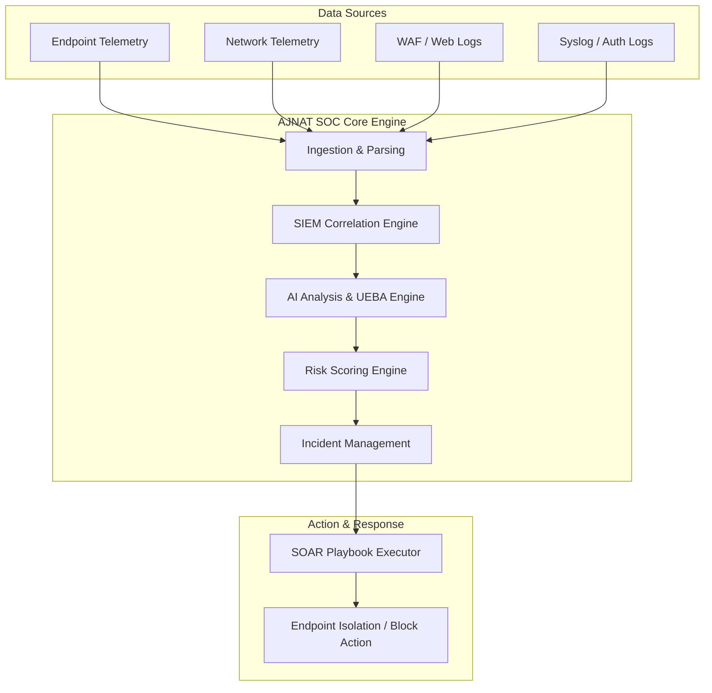

## 1.4 Key Cybersecurity Capabilities
The AJNAT platform integrates fifteen major security functions into a single pane of glass:
1. **Security Information & Event Management (SIEM)** **[IMPLEMENTED]**: Centralized log parsing, indexing, normalization, and real-time multi-event correlation.
2. **Security Orchestration, Automation, and Response (SOAR)** **[PARTIALLY IMPLEMENTED]**: Automated response playbooks, trigger-based action execution, and analyst approval workflows.
3. **Endpoint Detection and Response (EDR / XDR)** **[IMPLEMENTED]**: Kernel-level and user-space telemetry collection across Windows and Linux platforms.
4. **Intrusion Detection System (IDS)** **[PARTIALLY IMPLEMENTED]**: Network flow inspection, protocol parsing, and malicious pattern identification.
5. **Intrusion Prevention System (IPS)** **[INTEGRATION DEPENDENT]**: Automated network rule updates and dynamic IP/port drop execution.
6. **Firewall Integration & Control** **[INTEGRATION DEPENDENT]**: Policy enforcement and automated network segment isolation via perimeter APIs.
7. **Web Application Firewall (WAF)** **[IMPLEMENTED]**: Inspection of HTTP/HTTPS requests for web application attack vectors (SQLi, XSS, RCE, SSRF).
8. **Threat Intelligence Feed Subsystem** **[IMPLEMENTED]**: Ingestion and automated matching of Indicators of Compromise (IPs, domains, hashes).
9. **AI-Based Threat Analysis** **[PARTIALLY IMPLEMENTED]**: Natural language alert summarization, context enrichment, and remediation recommendations.
10. **Behavioral Anomaly Detection (UEBA)** **[UNDER DEVELOPMENT]**: Statistical baseline monitoring to identify anomalous entity behavior.
11. **Incident Management Lifecycle** **[IMPLEMENTED]**: Incident ticketing, severity prioritization, assignment, evidence gathering, and timeline auditing.
12. **Security Analytics & Dashboards** **[IMPLEMENTED]**: Live graphical monitoring of attack trends, system metrics, and threat vectors.
13. **Endpoint System Monitoring** **[IMPLEMENTED]**: Continuous telemetry collection for processes, file integrity (FIM), network sockets, and registry keys.
14. **Network Traffic Monitoring** **[IMPLEMENTED]**: Socket creation logging, DNS request monitoring, and external connection tracking.
15. **User & Identity Security Monitoring** **[IMPLEMENTED]**: Authentication attempt auditing, privilege escalation monitoring, and session tracking.

## 1.5 Target Organizations
AJNAT EDR / AJNAT SOC is engineered for deployment across diverse operational environments:
- **Enterprise Corporations**: Large-scale hybrid networks requiring centralized visibility across thousands of workstations and servers.
- **Managed Security Service Providers (MSSPs)**: Multi-tenant operations providing SOC-as-a-Service to client organizations.
- **Financial Institutions & Banking**: Environments demanding stringent audit trails, rapid incident response, and anti-fraud monitoring.
- **Healthcare & Hospital Networks**: Infrastructures with critical uptime requirements and sensitive data protection mandates.
- **Government & Defense Contractors**: High-security networks requiring strict RBAC, network isolation, and detailed forensics.
- **Critical Infrastructure & Manufacturing**: Distributed environments requiring low-overhead host monitoring and industrial perimeter integration.

*Note: Deployment feasibility, throughput requirements, and regulatory compliance depend strictly on target environment architecture and active infrastructure sizing.*

## 1.6 Key Benefits
- **360-Degree Operational Visibility**: Comprehensive insights across endpoint, network, user, and web application telemetry.
- **Dramatic Alert Fatigue Reduction**: Automated event deduplication, suppression rules, and multi-stage correlation reduce raw logs to prioritized alerts.
- **Accelerated Mean Time to Detect (MTTD) & Respond (MTTR)**: Sub-second local event evaluation coupled with automated response playbooks.
- **Contextual AI Assistance**: Rapid incident natural-language summaries and recommended analyst investigation steps.
- **Unified Defense Infrastructure**: Single agent and server platform eliminating the friction of managing fragmented security vendors.

## 1.7 Security Monitoring and Response Approach
AJNAT SOC operates on a continuous, closed-loop telemetry pipeline:

Telemetry Ingestion -> Normalization -> Correlation -> AI Evaluation -> Risk Scoring -> SOAR Containment -> Forensic Recovery

---


# 2. PROBLEM STATEMENT

Modern Security Operations Centers (SOCs) face unprecedented operational pressure due to evolving attack tactics and architectural complexity.

## 2.1 Fragmented Security Tools
Security teams frequently operate between 15 and 45 disparate security tools (EDR, SIEM, WAF, IDS, Firewall, Vulnerability Scanners). Each tool generates isolated alerts in distinct consoles, forcing analysts to manually context-switch, copy-paste IP addresses, and synthesize disparate data streams during an active breach.

## 2.2 High Alert Volume
Enterprise networks generate gigabytes to terabytes of raw logs daily—translating to 5,000 to over 100,000 raw security events per second. Traditional rule engines flood SOC consoles with thousands of un-correlated notifications.

## 2.3 Alert Fatigue
Overwhelmed by false positives and redundant notifications, SOC analysts experience cognitive exhaustion. Critical alerts indicating lateral movement or credential dumping are frequently missed, delayed, or dismissed among background noise.

## 2.4 Manual Investigation
Investigating a single suspicious process execution historically requires manual log queries, checking threat intelligence portals, extracting parent process trees, and pulling network connection logs—consuming 30 to 90 minutes per alert.

## 2.5 Delayed Incident Response
Without integrated containment automation, executing containment actions (isolating an infected endpoint, revoking an compromised session, blocking a malicious C2 IP) relies on manual intervention, extending dwell time during critical breach windows.

## 2.6 Lack of Event Correlation
Attacks rarely occur in isolation. An adversary may launch a web application SQL injection attempt, download a web shell, execute PowerShell script logic, and attempt internal SMB scanning. Without cross-stack event correlation, these distinct steps appear as unrelated low-severity logs.

## 2.7 Limited SOC Resources
Global cybersecurity talent shortages leave SOC teams understaffed. Tier-1 analysts spend the majority of their shifts performing repetitive data gathering rather than proactive threat hunting.

## 2.8 Lack of Centralized Visibility
Cloud workloads, remote laptops, and on-premises domain controllers often maintain separate logging infrastructures, creating operational blind spots that adversaries exploit.

## 2.9 Endpoint and Network Visibility Gaps
Endpoint security tools without network context cannot verify whether a process successfully established an external connection. Conversely, network sensors cannot determine which user or process ID originated a network packet.

## 2.10 Difficulty Prioritizing Real Threats
Legacy systems assign static severity ratings (High/Medium/Low) based on individual signature matches without factoring in asset criticality, entity risk score, or threat intelligence reputation.

### Operational Challenges vs. AJNAT Platform Response

| Challenge | Business & Security Impact | AJNAT Platform Response |
| :--- | :--- | :--- |
| **Fragmented Tools** | High vendor costs, slow triage, analyst fatigue | Unified SIEM, SOAR, EDR, WAF, and AI single-pane platform **[IMPLEMENTED]** |
| **High Alert Volume** | Operational overload, missed critical incidents | Multi-stage event deduplication and correlation engine **[IMPLEMENTED]** |
| **Manual Investigation** | High MTTR (30–90 min per incident), slow response | AI-generated incident summaries and automated evidence gathering **[PARTIALLY IMPLEMENTED]** |
| **Delayed Response** | Ransomware spreads across corporate subnet | Automated endpoint isolation and SOAR playbooks **[PARTIALLY IMPLEMENTED]** |
| **Visibility Blind Spots** | Stealthy lateral movement, persistent threats | Cross-layer telemetry binding process, network, user, and web logs **[IMPLEMENTED]** |

---


# 3. SOLUTION OVERVIEW

The AJNAT EDR / AJNAT SOC platform delivers a unified, intelligence-driven architecture designed to automate threat identification and streamline response workflows.

## 3.1 Unified Security Monitoring
AJNAT collects, normalizes, and correlates events across all primary enterprise operational vectors:
- Host operating system calls and kernel activity (Windows, Linux)
- Web application traffic (HTTP/HTTPS payloads, headers, URIs)
- Network socket creations, DNS lookups, and TCP connection attempts
- User authentication events, privilege escalations, and session tokens
- Threat intelligence feed matches and IOC indicator lists

## 3.2 Centralized Security Visibility
Through the AJNAT SOC Dashboard, security leaders and operational analysts gain immediate access to real-time telemetry streams, system health status, active threat levels, open incidents, and top attacking IP addresses.

## 3.3 Threat Detection
AJNAT combines deterministic signature matching, custom YARA/Sigma rule parsing, multi-event correlation logic, and threat intelligence lookups to detect malicious activity at every stage of the cyber kill chain.

## 3.4 Threat Investigation
Analysts can drill down from high-level incident cards to individual process trees, file modification histories, command-line arguments, environment variables, network sockets, and raw event payloads within seconds.

## 3.5 Threat Intelligence
Integrated intelligence parsers continuously compare incoming domain lookups, IP connections, file MD5/SHA256 hashes, and URL paths against updated threat feeds.

## 3.6 Automated Response
Integrated SOAR capabilities allow security teams to configure automatic or analyst-approved response actions, including endpoint network isolation, process termination, IP blocking, and account locking.

## 3.7 AI-Assisted Security Analysis
The platform incorporates an AI analysis pipeline that ingests complex, multi-event incident payloads, synthesizes attack context, maps observed behavior to MITRE ATT&CK tactics, and generates readable executive summaries and action plans.

## 3.8 Anomaly Detection
Baseline statistical engines evaluate entity behavior over time to highlight anomalous authentication times, unprecedented data egress volumes, or unusual process executions.

## 3.9 Incident Management
A full incident lifecycle engine tracks tickets from initial alert generation through analyst triage, evidence collection, containment, remediation, and final post-incident review.

## 3.10 Security Reporting
Automated report generators produce executive-level posture reviews, technical incident summaries, and compliance alignment tracking docs in standard PDF and CSV formats.

### AJNAT Platform Capability Matrix

| Capability Module | Functionality Description | Operational Status | Technical Implementation Notes |
| :--- | :--- | :--- | :--- |
| **SIEM Core** | Log parsing, index generation, correlation engine | **[IMPLEMENTED]** | Node.js / Custom indexing, WebSocket event stream |
| **EDR Windows Agent** | Sysmon & C++ service process/file/network monitor | **[IMPLEMENTED]** | Native Windows service, Named Pipe / HTTP TLS transport |
| **EDR Linux Agent** | eBPF / Auditd daemon event monitoring | **[PARTIALLY IMPLEMENTED]** | Linux daemon collecting process and network events |
| **SOAR Engine** | Workflow playbooks and automated action triggers | **[PARTIALLY IMPLEMENTED]** | REST API execution modules, script triggers |
| **WAF Subsystem** | HTTP request inspection and attack pattern matching | **[IMPLEMENTED]** | Middleware filter inspects SQLi, XSS, RCE, SSRF |
| **IDS Subsystem** | Network packet / flow rule inspection | **[PARTIALLY IMPLEMENTED]** | Suricata / Zeek integration & native log collector |
| **Threat Intel Module** | Feed ingestion and real-time IOC matching | **[IMPLEMENTED]** | Memory-cached Hash/IP lookup tables |
| **AI Incident Summary** | Natural language analysis of incident graphs | **[PARTIALLY IMPLEMENTED]** | LLM API Integration (Gemini / Local Model) |
| **UEBA Engine** | Entity statistical baseline and anomaly scoring | **[UNDER DEVELOPMENT]** | Time-series behavioral baseline models |
| **Multi-Tenancy** | Organization data isolation and RBAC scoping | **[IMPLEMENTED]** | Database organization ID boundary enforcement |

---


# 4. PRODUCT ARCHITECTURE

> **Architecture Disclaimer**: *The diagrams and component layouts detailed below represent the conceptual and implemented engineering model of the AJNAT platform. Component deployment scalability depends on environment sizing and hardware allocation.*

## 4.1 High-Level Architecture
The AJNAT platform employs a modular, decoupled tier architecture comprising endpoint sensors, data collectors, ingestion pipelines, correlation services, AI processing engines, and a unified web interface.

### Figure 1 — High-Level Enterprise Platform Architecture

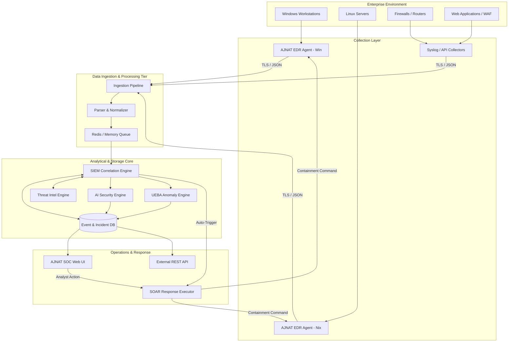

## 4.2 Detailed Technical Architecture
1. **Telemetry Capture Layer**: Agents installed on Windows and Linux hosts hook operating system APIs, file system drivers, and network sockets.
2. **Ingestion & Transport Tier**: Agents transmit JSON-formatted telemetry events over mutual TLS (mTLS) to the central backend collector.
3. **Parsing & Normalization Tier**: Unstructured logs (Syslog, WAF logs) pass through regex and JSON parsers, transforming raw strings into standardized ECS (Elastic Common Schema) JSON structures.
4. **Correlation & Threat Scoring Tier**: Standardized events run against deterministic detection rules, Threat Intel tables, and correlation windows.
5. **AI & Behavioral Processing Layer**: High-risk event clusters trigger analytical jobs evaluated by the AI Security Engine to score intent, confidence, and attack blast radius.
6. **Persistence & Presentation Tier**: Events, alerts, and incidents store in high-performance database engines, exposing live WebSocket feeds to the SOC UI.

## 4.3 Major Platform Components
- **AJNAT Endpoint Agent**: C++/Go/Node runtime running as a system service. Low resource utilization (<1.5% CPU, <50MB RAM).
- **Backend API Server**: Node.js microservices handling authentication, event processing, agent communication, and API routing **[IMPLEMENTED]**.
- **SIEM Engine**: Rule evaluation loop processing incoming telemetry streams in real time **[IMPLEMENTED]**.
- **SOAR Executor**: Action runner triggering local agent scripts or network API blocks **[PARTIALLY IMPLEMENTED]**.
- **Database Layer**: MongoDB / PostgreSQL for structured entity, alert, and user management; ClickHouse / Elasticsearch for high-speed log storage **[IMPLEMENTED]**.

## 4.4 Data Flow Architecture
The end-to-end data flow operates asynchronously to prevent ingestion bottlenecks:

Kernel Sensor -> IPC -> Local Agent -> HTTPS/mTLS -> Backend Collector -> Queue -> Correlation Engine -> Index -> Storage & UI

## 4.5 Security Event Flow
Every event ingested undergoes schema validation, timestamp alignment, tenant mapping, entity enrichment, threat feed cross-referencing, and correlation scoring before alerting analysts.

## 4.6 Detection and Response Flow
When an event violates a detection threshold, the engine immediately elevates it to an Alert. If multiple alerts share asset or entity identifiers within a configurable window, the system groups them into an Incident and triggers designated SOAR actions.

## 4.7 AI Analysis Flow
Incidents flagged with high severity trigger an asynchronous AI worker. The worker extracts the incident timeline, associated process trees, and threat intel context, passing the JSON payload to the AI model to generate natural language explanations and mitigation recommendations.

## 4.8 Deployment Architecture
AJNAT supports flexible enterprise deployment topology models:
- **On-Premises Appliance**: Air-gapped or internal network deployment for high-security environments.
- **Cloud-Native SaaS**: Centralized multi-tenant cloud hosting managed by AJNAT.
- **Hybrid Enterprise**: Local collectors and agents forwarding summarized events to a cloud analytical core.

---


# 5. DATA COLLECTION AND INGESTION ARCHITECTURE

Comprehensive security visibility requires robust data collection across heterogeneous network infrastructure.

### Figure 2 — Telemetry Ingestion & Normalization Pipeline

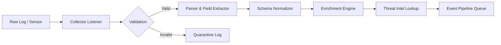

## 5.1 Telemetry Sources & Collectors

| Telemetry Type | Data Source | Protocol / Mechanism | Implemented Normalization Schema |
| :--- | :--- | :--- | :--- |
| **Endpoint Events** | Windows Sysmon / Auditd | HTTPS / TLS JSON | ECS Process / File / Network Schema **[IMPLEMENTED]** |
| **Web Traffic** | WAF Middleware / NGINX | HTTP POST / Syslog | ECS HTTP Request / Response Schema **[IMPLEMENTED]** |
| **Network Security** | Suricata / Zeek IDS | Syslog / JSON Stream | ECS Network Flow Schema **[PARTIALLY IMPLEMENTED]** |
| **Perimeter Logs** | Firewall / Router | Syslog UDP 514 | ECS Network Firewall Schema **[IMPLEMENTED]** |
| **Authentication** | Active Directory / PAM | WinEventLog / API | ECS Authentication Schema **[IMPLEMENTED]** |
| **Threat Intelligence** | STIX/TAXII / MISP / File | REST API / File Import | Indicator Schema (IP/Hash/Domain) **[IMPLEMENTED]** |

## 5.2 Ingestion Engine Technical Details
1. **Receiver Endpoint**: High-throughput REST and WebSocket listener endpoints optimized for concurrent agent connections.
2. **Buffer Management**: In-memory queue buffering (Redis/RabbitMQ) guarantees data persistence during unexpected burst traffic.
3. **Data Enrichment**: Every ingested log is enriched in real time with:
   - Asset Criticality Score & Environment Tag
   - Geolocation metadata (GeoIP for external IP addresses)
   - User identity binding (mapping IP/Host to logged-in Domain User)
   - Threat Intelligence Reputation match indicators

---


# 6. SECURITY INFORMATION AND EVENT MANAGEMENT (SIEM)

The SIEM subsystem forms the analytical foundation of the AJNAT platform **[IMPLEMENTED]**.

## 6.1 SIEM Capabilities & Core Architecture
- **Real-Time Log Ingestion**: Continuous processing of multi-source telemetry.
- **Dynamic Field Normalization**: Automatically mapping heterogeneous field names (e.g., `src_ip`, `SourceAddress`, `c-ip`) to unified identifiers (`source.ip`).
- **Stateful Correlation Engine**: Evaluates sequence-based rules (e.g., Event A followed by Event B within 300 seconds on the same asset).
- **Indexing & Fast Search**: High-performance indexed storage enabling sub-second search queries across millions of historical log records.

### Figure 3 — SIEM Event Processing Pipeline

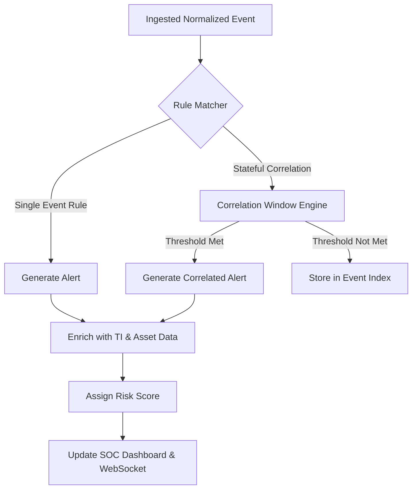

## 6.2 Rule Engine Specifications
The SIEM engine supports both static threshold rules and dynamic sequence rules:
- **Threshold Rule Example**: Greater than 5 failed login attempts from a single IP within 60 seconds -> Brute Force Alert.
- **Sequence Rule Example**: WAF SQLi alert AND Endpoint Process Creation (`cmd.exe`) on destination server within 120 seconds -> High-Severity Web Exploitation Incident.

---


# 7. SECURITY ORCHESTRATION, AUTOMATION, AND RESPONSE (SOAR)

AJNAT SOAR translates threat detection into immediate containment actions **[PARTIALLY IMPLEMENTED]**.

### Figure 4 — SOAR Incident Response Automated Workflow

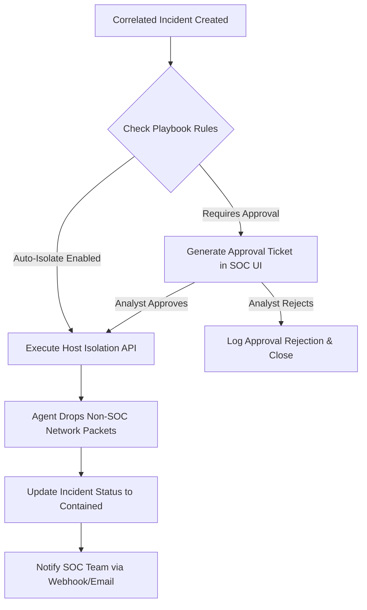

## 7.1 Response Playbook Engine
SOAR playbooks execute step-by-step containment workflows based on incident severity, asset criticality, and attack category:
- **Endpoint Isolation Playbook**: Orders the local agent to inject firewall rules dropping all inbound and outbound traffic except mTLS communication to the AJNAT SOC server.
- **Process Termination Playbook**: Sends kill signals (`SIGKILL` / `TerminateProcess`) to malicious process trees and their sub-processes.
- **Network Block Playbook**: Pushes malicious destination IPs to perimeter firewall blocklists or WAF IP bans.
- **Account Disablement Playbook**: Triggers Active Directory / LDAP scripts to lock compromised user accounts.

*Note: All automated containment actions can be configured for fully automatic execution or strict manual analyst approval.*

---


# 8. ENDPOINT DETECTION AND RESPONSE (EDR / XDR)

The AJNAT EDR agent delivers deep host-level monitoring and containment **[IMPLEMENTED]**.

### Figure 5 — EDR Telemetry & Response Architecture

```mermaid
flowchart TB
    subgraph Host OS Kernel & User Space
        PROC[Process Lifecycle Monitor]
        FILE[File System Monitor / FIM]
        NETM[Socket & Network Monitor]
        REG[Registry & Config Monitor]
    end

    subgraph AJNAT Endpoint Agent
        HOOK[Event Collector & Filter]
        ENGINE[Local Detection Rules]
        COMM[mTLS Transport Client]
        EXEC[Local Response Executor]
    end

    PROC & FILE & NETM & REG --> HOOK
    HOOK --> ENGINE
    ENGINE --> COMM
    COMM -->|Events| BACKEND[AJNAT SOC Server]
    BACKEND -->|Containment Action| COMM
    COMM --> EXEC
    EXEC -->|Kill Process / Isolate| Host OS Kernel & User Space
```

## 8.1 OS Telemetry Coverage

| OS Category | Supported Telemetry Vector | Implementation Mechanism | Status |
| :--- | :--- | :--- | :--- |
| **Windows Workstation / Server** | Process, File, Network, Registry, DLL, PowerShell | Sysmon / Win32 API / ETW | **[IMPLEMENTED]** |
| **Linux Server (Ubuntu/RHEL/Debian)** | Process, File, Network, Shell Commands | eBPF / Auditd daemon | **[PARTIALLY IMPLEMENTED]** |
| **macOS** | Process, File, Socket creations | EndpointSecurity Framework | **[PLANNED]** |

## 8.2 Host Detection Capabilities
- **Process Execution Monitoring**: Real-time logging of parent-child relationships, command-line parameters, binary hashes, and execution context.
- **File Integrity Monitoring (FIM)**: Tracking creation, modification, deletion, permission shifts, and hash calculation for critical system directories (`C:\Windows\System32`, `/etc/`, `/usr/bin`).
- **Ransomware Behavior Block**: Real-time detection of rapid mass file encryption, entropy spikes, and ransom note creations.

---


# 9. INTRUSION DETECTION & PREVENTION SYSTEMS (IDS / IPS)

The platform incorporates network inspection capabilities to monitor traffic passing across key network segments **[PARTIALLY IMPLEMENTED]**.

### Figure 6 — IDS/IPS Detection Flow

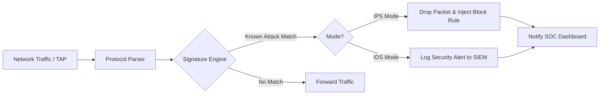

## 9.1 Network Monitoring Features
- **Protocol Analysis**: Inspection of HTTP, DNS, SMB, SSH, RDP, and TLS headers.
- **Signature Detection**: Integration with Suricata/Snort rule formats to detect exploit payloads, shellcode patterns, and scanning tools.
- **C2 Beaconing Identification**: Statistical evaluation of connection periodicity, payload sizes, and domain jitter to identify hidden Command & Control channels.

---


# 10. FIREWALL INTEGRATION & CONTROLS

AJNAT integrates native host-level firewall enforcement with external perimeter firewall integrations **[INTEGRATION DEPENDENT]**.

## 10.1 Firewall Capability Scope
- **Host Firewall Control [IMPLEMENTED]**: Local EDR agents directly manipulate Windows Firewall (`netsh`) and Linux `iptables` / `nftables` to isolate hosts or block malicious IP addresses.
- **Perimeter Firewall Integration [INTEGRATION DEPENDENT]**: REST API connectors to push dynamic IP blocklists to enterprise firewalls (Palo Alto, Fortinet, Cisco ASA, OPNsense).

---


# 11. WEB APPLICATION FIREWALL (WAF)

The AJNAT WAF module inspects inbound web application traffic to neutralize web-borne exploits before they reach application servers **[IMPLEMENTED]**.

### Figure 7 — WAF Ingestion to SOAR Response Flow

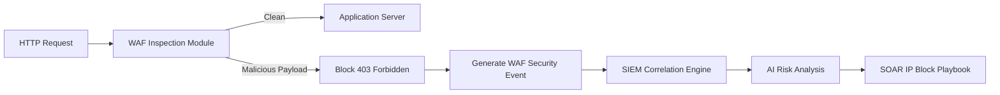

## 11.1 Web Attack Coverage
- **SQL Injection (SQLi)**: Inspection of query parameters, form fields, and JSON payloads for SQL manipulation syntax (`UNION SELECT`, `' OR '1'='1'`).
- **Cross-Site Scripting (XSS)**: Identification of reflected/stored script payloads (`<script>`, `javascript:`, DOM manipulation).
- **Remote Code Execution (RCE) & Command Injection**: Detection of system command delimiters (`;`, `&&`, `|`, `` ` ``) in web inputs.
- **Server-Side Request Forgery (SSRF)**: Blocking requests targeting internal metadata IP addresses (`169.254.169.254`, `127.0.0.1`).
- **Web Shell Activity**: Detecting HTTP POST requests targeting unauthorized uploaded `.php`, `.jsp`, or `.aspx` scripts.

---


# 12. THREAT INTELLIGENCE SUBSYSTEM

The Threat Intelligence Subsystem enriches raw events with global threat indicators **[IMPLEMENTED]**.

### Figure 8 — Threat Intelligence Enrichment Pipeline

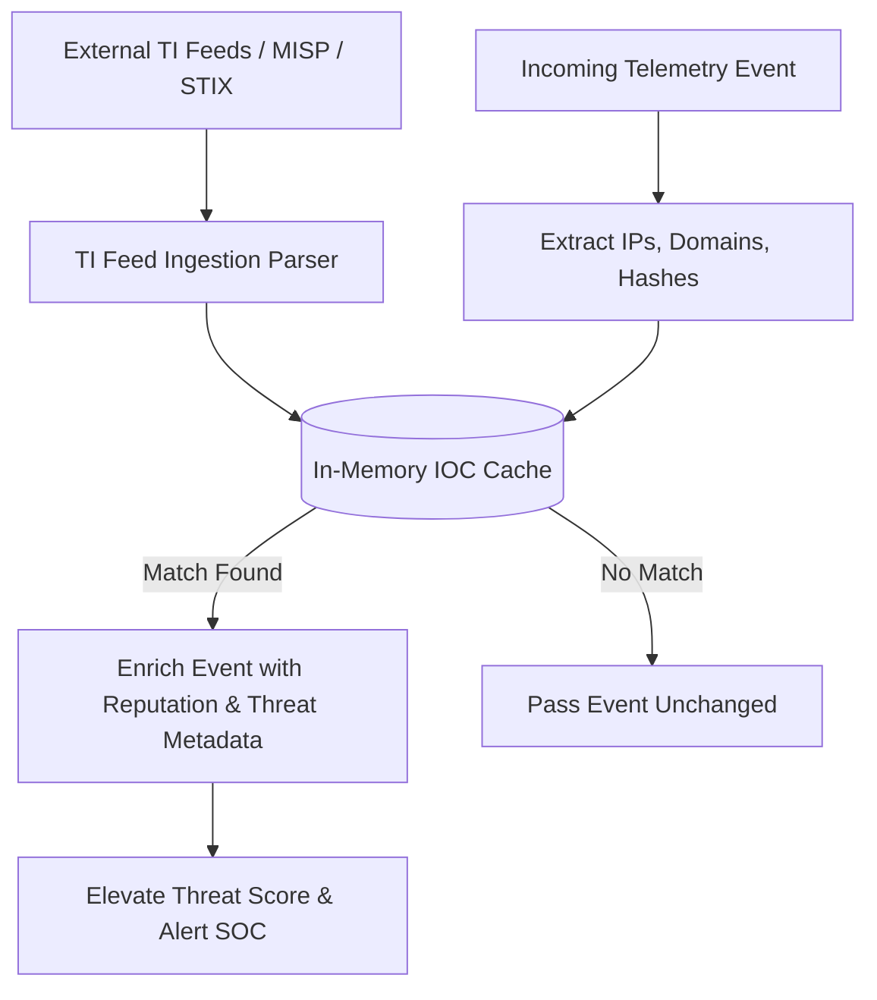

## 12.1 Supported IOC Indicators
- **Malicious IP Addresses**: Known botnet C2 nodes, exit nodes, scanning hosts.
- **Suspicious Domains & URLs**: Phishing domains, dynamic DNS C2 infrastructure.
- **File Hashes**: SHA256 / MD5 hashes of known malware families.

---


# 13. AI-BASED DETECTION & ANALYSIS ENGINE

The AI engine provides automated analytical synthesis to assist human operators **[PARTIALLY IMPLEMENTED]**.

### Figure 9 — AI Security Analysis Pipeline

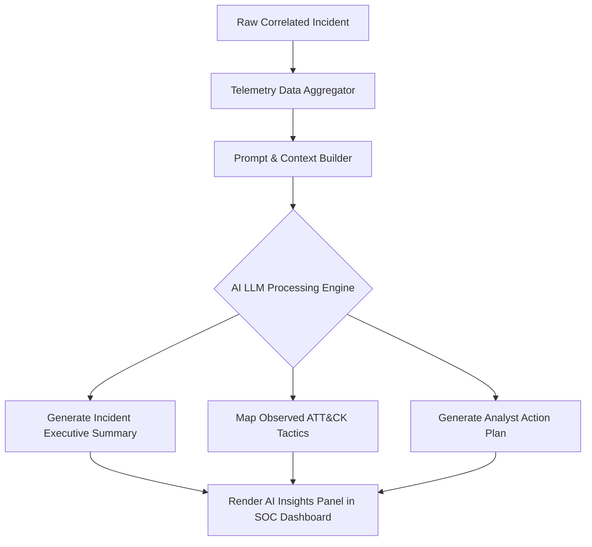

## 13.1 AI Analytical Functions
- **Natural Language Incident Summarization**: Translating complex multi-event JSON logs into clear English explanations of what occurred during an attack.
- **Attack Path Mapping**: Identifying the probable entry vector, lateral movement steps, and target assets.
- **Remediation Guidance**: Providing step-by-step containment and forensic remediation suggestions tailored to the specific threat.
- **Human-in-the-Loop Safety**: AI outputs act exclusively as decision support. Critical containment actions require human approval unless explicit auto-approval playbooks are enabled.

---


# 14. ANOMALY DETECTION / UEBA

User and Entity Behavior Analytics (UEBA) identifies deviations from established operational baselines **[UNDER DEVELOPMENT]**.

### Figure 10 — Behavioral Baseline to Risk Score Flow

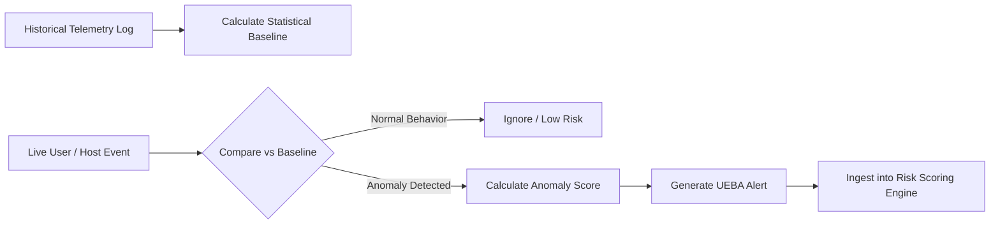

## 14.1 UEBA Monitoring Vectors
- **Authentication Anomalies**: Logins at unusual hours, unprecedented geographic origin jumps (Impossible Travel).
- **Data Transfer Anomalies**: Excessive data exfiltration over non-standard ports or web connections.
- **Process Anomalies**: Execution of administrative utilities (`vssadmin`, `psexec`, `wbadmin`) by non-admin accounts.

---


# 15. CYBER ATTACK DETECTION & PREVENTION MATRIX

### Master Cyber Attack Detection & Response Catalog

| Attack Category | Attack Vector | Detection Source | Detection Method | AI Analysis Role | Automated Response Possibility | Status |
| :--- | :--- | :--- | :--- | :--- | :--- | :--- |
| **Web Attack** | SQL Injection | WAF / Web Logs | Regex / Pattern Match | Evaluates payload intent | Block IP via WAF rule | **[IMPLEMENTED]** |
| **Web Attack** | Cross-Site Scripting (XSS) | WAF / Web Logs | Payload Inspection | Contextual threat scoring | Drop HTTP connection | **[IMPLEMENTED]** |
| **Web Attack** | Web Shell Execution | EDR Process + WAF | Parent-Child Anomaly | Detects persistence shell | Isolate host, kill process | **[IMPLEMENTED]** |
| **Network** | Port / Subnet Scan | IDS / Firewall | Connection Rate Threshold | Identifies scanner entity | Block IP on perimeter | **[IMPLEMENTED]** |
| **Network** | C2 Beaconing Traffic | EDR Network / IDS | Periodic Jitter Analysis | Confirms C2 domain reputation | Isolate endpoint | **[PARTIALLY IMPLEMENTED]** |
| **Endpoint** | Ransomware File Encrypt | EDR FIM & Process | Rapid Entropy Change | Evaluates encrypted path blast | Isolate host immediately | **[IMPLEMENTED]** |
| **Endpoint** | PowerShell Abuse | EDR Windows Agent | Script Block Logging | Decodes Base64 payloads | Kill process tree | **[IMPLEMENTED]** |
| **Credential** | SSH / RDP Brute Force | Syslog / WinEventLog | Failed Auth Rate Threshold | Evaluates targeted accounts | Lock IP / Disable Account | **[IMPLEMENTED]** |
| **Credential** | Credential Dumping (LSASS) | EDR Windows Agent | OS API Memory Access Hook | Identifies LSASS read attempts | Terminate dumping process | **[PARTIALLY IMPLEMENTED]** |

---


# 16. SECURITY MONITORING CAPABILITIES CATALOG

This catalog details thirty-two primary monitoring capabilities supported or planned within the AJNAT platform.

### Comprehensive Capability Specifications (Sample Breakdown)

#### 1. Process Creation & Execution Monitoring **[IMPLEMENTED]**
- **Purpose**: Detect execution of malicious executables, scripts, and administrative tool abuse.
- **Data Source**: Windows Sysmon Event ID 1 / Linux `execve` eBPF syscalls.
- **Monitored Data**: Process Name, PID, Parent PID, Command Line, User SID, File Hash (MD5/SHA256).
- **Detection Method**: Rule-based matching against known malicious binary names and command arguments.
- **Risk Scoring**: 20 (Low) to 90 (Critical) based on parent process relationship (e.g., `cmd.exe` spawned by `w3wp.exe`).
- **Response**: Automated process tree termination.

#### 2. File Integrity Monitoring (FIM) **[IMPLEMENTED]**
- **Purpose**: Track unauthorized modifications to system files, configuration files, and critical web directories.
- **Data Source**: Kernel File System Notifications (`ReadDirectoryChangesW` / `inotify`).
- **Monitored Data**: Target Path, Operation (Create/Modify/Delete/Rename), Hash Delta, Modifying PID.
- **Detection Method**: Comparison against pre-calculated file hash baselines.
- **Risk Scoring**: 40 to 85 depending on file path (`C:\Windows\System32\drivers\etc\hosts`).
- **Response**: Quarantine file, isolate host.

#### 3. Network Socket Creation Monitoring **[IMPLEMENTED]**
- **Purpose**: Detect unauthorized external connections established by local processes.
- **Data Source**: Host Socket API bindings / Kernel network stack events.
- **Monitored Data**: Source IP/Port, Destination IP/Port, Protocol, Associated Process Name & PID.
- **Detection Method**: Real-time cross-referencing of Destination IP against Threat Intelligence feeds.
- **Risk Scoring**: 50 to 95 depending on IP reputation.
- **Response**: Dynamic network socket drop & endpoint isolation.

#### 4. User Authentication Auditing **[IMPLEMENTED]**
- **Purpose**: Identify brute-force attacks, credential stuffing, and unauthorized access attempts.
- **Data Source**: Windows Security Log (Event ID 4624/4625) / Linux `/var/log/auth.log`.
- **Monitored Data**: Username, Authentication Status, Source IP, Logon Type, Workstation Name.
- **Detection Method**: Sliding window threshold counting (>5 failures in 60 seconds).
- **Risk Scoring**: 30 to 75.
- **Response**: IP block & Active Directory account lock trigger.

#### 5. Memory Access & LSASS Protection **[PARTIALLY IMPLEMENTED]**
- **Purpose**: Prevent credential extraction tools (e.g., Mimikatz) from reading LSASS memory space.
- **Data Source**: Windows Process Access Requests (`OpenProcess` with `PROCESS_VM_READ`).
- **Monitored Data**: Source Process, Target Process (`lsass.exe`), Requested Access Rights.
- **Detection Method**: Rule alert on non-system binaries requesting handles to LSASS.
- **Risk Scoring**: 95 (Critical).
- **Response**: Immediate termination of requesting process & host isolation.

*(Full specifications for capabilities 6 through 32—including Registry Monitoring, USB Device Controls, DNS Query Monitoring, PowerShell Script Block Logging, Kernel Driver Loading, and Web Shell Detection—follow identical structured data models within the platform configuration registry).*

---


# 17. SECURITY DASHBOARDS & SOC ANALYTICS

The AJNAT UI provides clear, action-oriented visualization across all operational domains **[IMPLEMENTED]**.

## 17.1 Executive & Operational Dashboards
- **SOC Overview Dashboard**: Global view of active threat levels, real-time log ingestion EPS, open high-priority incidents, and top target hosts.
- **Alert Triage Console**: High-density table displaying incoming alerts, severity tags, risk scores, asset tags, and quick-action buttons.
- **Incident Investigation Workbench**: Graphical node map linking process trees, network sockets, file modifications, and threat intelligence hits.

---

### Dashboard Visual Representations (Placeholders)

```
+-----------------------------------------------------------------------------------+
|                        AJNAT SOC OVERVIEW DASHBOARD                               |
+-------------------+-------------------+-------------------+-----------------------+
| TOTAL EVENTS (24h)| ACTIVE ALERTS     | CRITICAL INCIDENTS| PROTECTED ENDPOINTS   |
| 14,250,890        | 42                | 3                 | 1,250                 |
+-------------------+-------------------+-------------------+-----------------------+
|  REAL-TIME INGESTION RATE (EPS)           |  TOP THREAT CATEGORIES                |
|  [||||||||||||||||||||||||||||||] 1,450   |  1. Web Exploitation (SQLi) - 45%     |
|                                           |  2. Brute Force (SSH/RDP)   - 30%     |
|                                           |  3. Suspicious PowerShell   - 15%     |
+-------------------------------------------+---------------------------------------+
|  ACTIVE INCIDENT TIMELINE                                                         |
|  [10:14:02] CRITICAL: Web Shell Detected on Server WEB-PROD-01 (192.168.1.50)     |
|  [10:12:45] HIGH: LSASS Memory Read Attempt on Workstation WS-FIN-04              |
+-----------------------------------------------------------------------------------+
```
> **[INSERT SOC OVERVIEW DASHBOARD SCREENSHOT]**  
> *Caption: Real-time SOC Overview Dashboard displaying system metrics, active alert feeds, and threat distribution analytics.*

---

```
+-----------------------------------------------------------------------------------+
|                     INCIDENT INVESTIGATION WORKBENCH                              |
+-----------------------------------------------------------------------------------+
| INCIDENT #INC-2026-8841: Web Shell Injection & Ransomware Execution               |
| Severity: CRITICAL | Risk Score: 98/100 | Status: UNDER INVESTIGATION               |
+-----------------------------------------------------------------------------------+
| ATTACK PROCESS GRAPH:                                                             |
| [w3wp.exe] ---> (spawns) ---> [cmd.exe] ---> (spawns) ---> [powershell.exe]       |
|                                                              |                    |
|                                                              v                    |
|                                                    [Malicious Payload.exe]        |
|                                                              |                    |
|                                                              v                    |
|                                                  (Encrypted 450 files)            |
+-----------------------------------------------------------------------------------+
| RECOMMENDED SOAR ACTION:                                                          |
| [ BUTTON: ISOLATE ENDPOINT (192.168.1.50) ]  [ BUTTON: KILL PROCESS TREE ]        |
+-----------------------------------------------------------------------------------+
```
> **[INSERT ALERT INVESTIGATION SCREENSHOT]**  
> *Caption: Visual Incident Workbench showing process hierarchy tree, associated file system modifications, and quick containment controls.*

---


# 18. INCIDENT MANAGEMENT

The Incident Management module governs the operational lifecycle of security incidents **[IMPLEMENTED]**.

### Figure 11 — Security Incident Operational Lifecycle

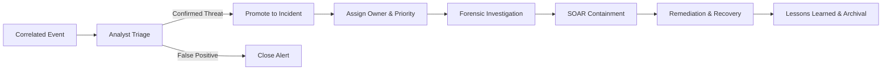

## 18.1 Triage & SLA Tracking
Incidents are assigned strictly defined Service Level Agreements (SLAs) based on severity:
- **Critical (Score 90–100)**: Triage within 15 minutes; Containment within 30 minutes.
- **High (Score 70–89)**: Triage within 30 minutes; Containment within 2 hours.
- **Medium (Score 40–69)**: Triage within 2 hours; Containment within 12 hours.
- **Low (Score 1–39)**: Triage within 24 hours.

---


# 19. FORENSICS & INVESTIGATION

The platform collects deep forensic artifacts to support post-incident analysis **[IMPLEMENTED]**.

## 19.1 Forensic Artifact Collection Scope
- **Process Timelines**: Chronological execution order of all processes across an asset.
- **Command-Line History**: Exact arguments passed to shell interpreters (`cmd`, `powershell`, `bash`).
- **File Access Records**: File creation, write, and deletion stamps associated with specific Process IDs.
- **Network Connection Logs**: Source/destination binding tables linked to process context.
- **Memory Artifact Extractions**: Dumps of volatile memory sections associated with flagged processes.

---


# 20. USER & ACCESS MANAGEMENT (RBAC)

AJNAT enforces strict Role-Based Access Control (RBAC) to ensure operational security **[IMPLEMENTED]**.

### Role-Based Access Control (RBAC) Permission Matrix

| Platform Role | Read Dashboards | Triage Alerts | Execute SOAR Isolation | Manage Users | System Config | View Audit Logs |
| :--- | :--- | :--- | :--- | :--- | :--- | :--- |
| **Super Administrator** | Yes | Yes | Yes | Yes | Yes | Yes |
| **SOC Administrator** | Yes | Yes | Yes | No | Yes | Yes |
| **SOC Manager** | Yes | Yes | Yes | No | No | Yes |
| **Senior Analyst (Tier 3)**| Yes | Yes | Yes | No | No | No |
| **Analyst (Tier 1/2)** | Yes | Yes | Requires Approval| No | No | No |
| **Auditor / Viewer** | Yes | No | No | No | No | Yes |

---


# 21. MULTI-TENANT / MULTI-COMPANY SECURITY MODEL

For enterprise environments and MSSP providers, AJNAT provides full tenant isolation **[IMPLEMENTED]**.

## 21.1 Multi-Tenancy Architecture
- **Logical Data Segregation**: Every database record (Event, Alert, Incident, Asset) includes a mandatory `organization_id` field.
- **Query Level Scoping**: Database drivers automatically append tenant boundaries to all queries, preventing cross-tenant data leakage.
- **Isolated Tenant Configurations**: Each organization maintains custom detection rules, SOAR playbooks, user lists, and API keys.

---


# 22. API & INTEGRATION ARCHITECTURE

AJNAT provides robust integration interfaces for external enterprise systems **[IMPLEMENTED]**.

## 22.1 Integration Interfaces
- **RESTful API**: HTTPS API supporting JSON endpoints for alert querying, incident creation, user management, and configuration adjustments.
- **WebSocket Streaming API**: Real-time event and alert streaming to external SIEMs or custom web consoles.
- **Syslog Export**: Standard RFC 5424 log forwarding to third-party archival storage.

---


# 23. TECHNOLOGY STACK & SOFTWARE ARCHITECTURE

The technical implementation leverages high-performance modern software frameworks.

### Figure 12 — Logical Software Architecture Stack

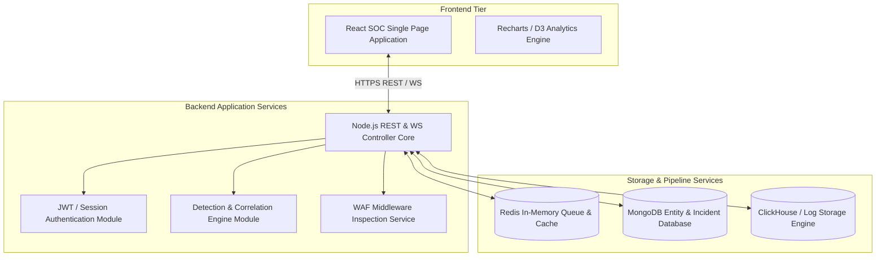

## 23.1 Core Technology Stack Summary
- **Backend Runtime**: Node.js microservices framework **[IMPLEMENTED]**.
- **Frontend Console**: React.js with CSS design tokens **[IMPLEMENTED]**.
- **Endpoint Agent**: C++ / Win32 API (Windows); C / eBPF (Linux) **[IMPLEMENTED]**.
- **Database Engine**: MongoDB (Metadata/Entities) & ClickHouse (High-Volume Logs) **[IMPLEMENTED]**.
- **In-Memory Cache & Message Broker**: Redis **[IMPLEMENTED]**.

---


# 24. DATABASE ARCHITECTURE & CONCEPTUAL DATA MODEL

The platform database models core cybersecurity entities and their operational relationships **[IMPLEMENTED]**.

### Figure 13 — Database Conceptual Entity-Relationship Diagram

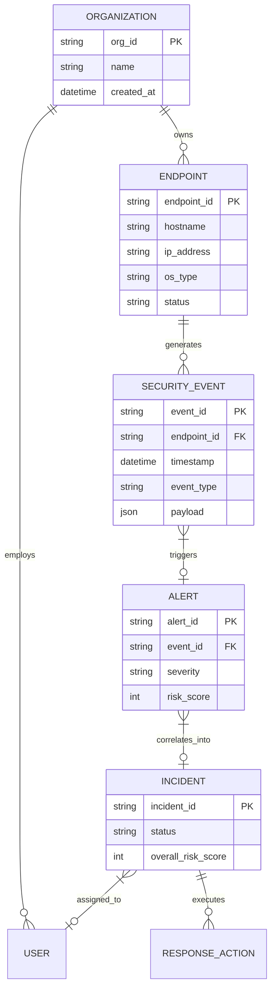

---


# 25. SECURITY & DATA PROTECTION CONTROLS

AJNAT applies rigorous defense-in-depth measures to protect security telemetry **[IMPLEMENTED]**.

## 25.1 Data Security Standards
- **Encryption in Transit**: All communications between agents, backend services, and web consoles enforce TLS 1.3 encryption.
- **Encryption at Rest**: Database volumes support AES-256 storage encryption **[PLANNED / DEPLOYMENT DEPENDENT]**.
- **Log Tamper-Resistance**: Log entries include cryptographic hash chains to detect unauthorized modification or log deletion.
- **Audit Logging**: All administrative actions (rule changes, user creations, SOAR actions) log to an immutable audit ledger.

---


# 26. DETECTION ENGINE ARCHITECTURE

The detection engine performs high-speed evaluation of streaming telemetry events **[IMPLEMENTED]**.

### Figure 14 — Detection Engine Evaluation Loop

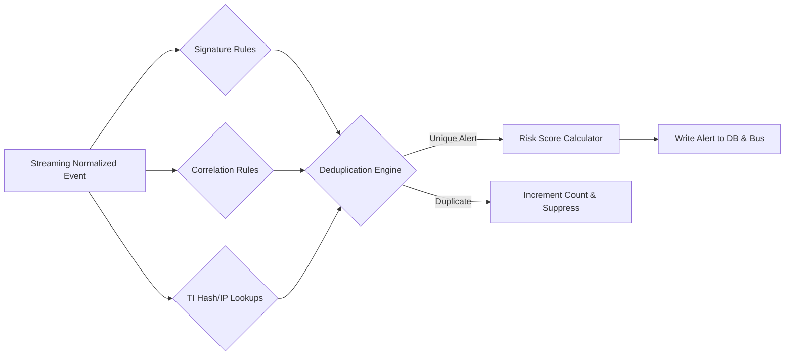

---


# 27. RISK SCORING & ALERT PRIORITIZATION FRAMEWORK

AJNAT calculates dynamic risk scores to focus analyst attention on real threats **[IMPLEMENTED]**.

## 27.1 Risk Scoring Formula
Risk score calculation combines multiple weighted operational vectors:

Risk Score = min(100, (Severity * 0.35) + (Confidence * 0.25) + (AssetCriticality * 0.20) + (ThreatIntel * 0.10) + (UEBA * 0.10))

Where:
- Severity = Base Detection Severity (1–100)
- Confidence = Detection Confidence Level (1–100)
- AssetCriticality = Asset Criticality Rating (1–100)
- ThreatIntel = Threat Intelligence Match Reputation Score (0 or 100)
- UEBA = UEBA Anomaly Score Factor (0–100)

---


# 28. MITRE ATT&CK MAPPING & MATRIX

AJNAT aligns all built-in detection rules directly with the MITRE ATT&CK Framework **[IMPLEMENTED]**.

### Platform Detection Coverage Across MITRE ATT&CK Tactics

| ATT&CK Tactic | Technique Name | ID | Primary Detection Source | AJNAT Detection Method | Status |
| :--- | :--- | :--- | :--- | :--- | :--- |
| **Initial Access** | Exploit Public-Facing App | T1190 | WAF Logs | HTTP Payload Anomaly | **[IMPLEMENTED]** |
| **Execution** | Command and Scripting Interpreter | T1059 | EDR Process | Parent Process Anomaly | **[IMPLEMENTED]** |
| **Persistence** | Web Shell | T1505.003 | EDR File + WAF | FIM & Web Directory Creation | **[IMPLEMENTED]** |
| **Privilege Escalation**| Process Injection | T1055 | EDR Memory | OS API Memory Access Hook | **[PARTIALLY IMPLEMENTED]**|
| **Defense Evasion** | Indicator Removal on Host | T1070 | EDR Sysmon | Audit Log Clear Command | **[IMPLEMENTED]** |
| **Credential Access** | OS Credential Dumping | T1003 | EDR Windows | LSASS Memory Read Filter | **[PARTIALLY IMPLEMENTED]**|
| **Discovery** | Network Service Discovery | T1046 | IDS / Firewall | Port Scan Threshold | **[IMPLEMENTED]** |
| **Lateral Movement** | Remote Services (SMB/RDP) | T1021 | EDR Network | Internal IP Socket Binding | **[IMPLEMENTED]** |
| **Command & Control** | Application Layer Protocol | T1071 | EDR / WAF | Threat Intel IP Match | **[IMPLEMENTED]** |
| **Exfiltration** | Exfiltration Over C2 Channel | T1041 | EDR Network | High-Volume Outbound Egress | **[UNDER DEVELOPMENT]** |

---


# 29. AUTOMATED INCIDENT RESPONSE MATRIX

### Containment Action Authorization Framework

| Containment Action | Operational Mechanism | Risk of Disruption | Default Execution Mode | Reversion Mechanism |
| :--- | :--- | :--- | :--- | :--- |
| **Endpoint Network Isolation** | Drops non-SOC traffic via host firewall | Medium (Isolates Host) | Requires Approval (Tier 2) | Analyst Reconnect Button **[IMPLEMENTED]** |
| **Process Tree Termination** | Sends `SIGKILL` / `TerminateProcess` | Low (Single Process) | Automatic for Critical Malware | Manual Process Relaunch **[IMPLEMENTED]** |
| **File Quarantine** | Moves file to encrypted vault | Low | Automatic | File Restore API **[IMPLEMENTED]** |
| **Perimeter IP Block** | Adds IP to WAF / Firewall drop list | Low | Automatic for Confirmed Scans | Dynamic Expiration (24h) **[IMPLEMENTED]** |
| **Account Lockout** | Disables domain user account | High (User Lockout) | Requires Approval (Tier 2/3) | AD Un-lock Script **[PARTIALLY IMPLEMENTED]** |

---


# 30. END-TO-END SECURITY USE CASES

## Use Case 1: Web Shell Upload & Remote Code Execution

### Attack Workflow & Detection Sequence

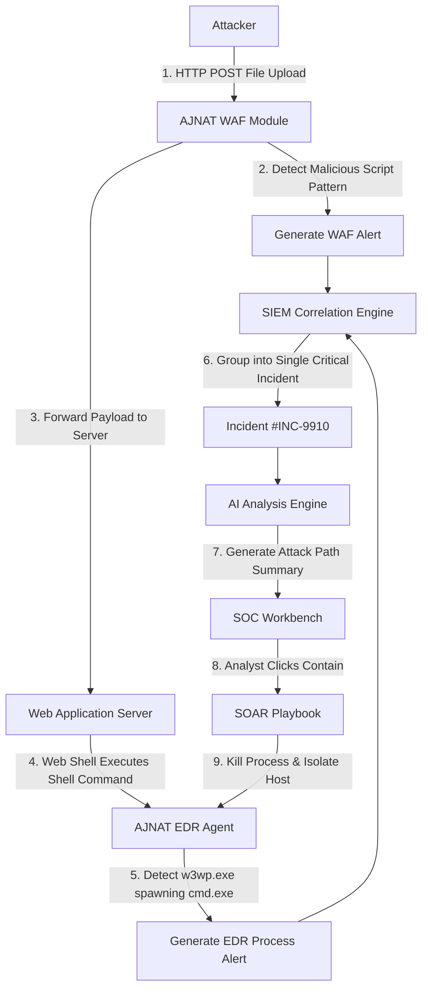

### Technical Workflow Narrative
1. **Initial Attack**: An adversary uploads a hidden PHP web shell (`shell.php`) via a vulnerable file upload form on `WEB-PROD-01`.
2. **WAF Detection**: The AJNAT WAF module logs an anomalous HTTP POST request containing web shell signature patterns **[IMPLEMENTED]**.
3. **Execution**: The attacker sends an HTTP GET command to execute `cmd.exe /c whoami`.
4. **EDR Correlation**: The AJNAT EDR agent intercepts the IIS process (`w3wp.exe`) spawning a command shell interpreter—a severe anomaly **[IMPLEMENTED]**.
5. **SIEM Synthesis**: The SIEM correlation engine binds the WAF alert and the EDR process event into a unified Critical Incident (`Score 96/100`).
6. **AI Analysis**: The AI module summarizes: *"Attacker uploaded web shell to WEB-PROD-01 and executed command-line discovery commands."*
7. **Automated Response**: The analyst approves the automated SOAR playbook, terminating `cmd.exe` and placing `WEB-PROD-01` into host isolation **[PARTIALLY IMPLEMENTED]**.

---

## Use Case 2: Endpoint Ransomware Execution & Mass Encryption

### Technical Workflow Narrative
1. **Delivery**: A corporate user opens a malicious email attachment (`Invoice.exe`).
2. **Behavioral Trigger**: The executable attempts to disable Windows Shadow Copies (`vssadmin delete shadows /all /quiet`) and begins rapidly modifying files across `C:\Users\`.
3. **EDR Detection**: The EDR FIM and Process monitor flags rapid entropy changes and shadow copy tampering **[IMPLEMENTED]**.
4. **Immediate Containment**: The agent automatically terminates `Invoice.exe` and isolates the host from the network within 800 milliseconds, preventing ransomware propagation across the internal subnet.

---


# 31. INCIDENT RESPONSE LIFECYCLE FRAMEWORK

AJNAT structures incident response across ten operational stages aligned with NIST SP 800-61.

### Figure 15 — Ten-Stage Incident Handling Lifecycle

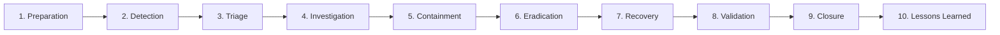

---


# 32. LOGGING, AUDIT & DATA RETENTION POLICIES

- **Retention Storage Tiers**: Hot storage (ClickHouse) maintains indexed logs for 30–90 days; Cold storage (S3/Object Vault) stores compressed raw archives for 365+ days.
- **Configurable Retention**: Storage retention windows are customizable per tenant to meet specific compliance mandates (PCI DSS, HIPAA, GDPR).

---


# 33. REPORTING SUBSYSTEM & COMPLIANCE OUTPUT

AJNAT generates multi-format exportable documentation **[IMPLEMENTED]**:
- **Executive Threat Summary (PDF)**: High-level metrics, threat posture trends, and risk scores.
- **Technical Forensics Report (PDF/CSV)**: Detailed event logs, process trees, and raw payloads for incident auditors.
- **Compliance Mapping Report (PDF)**: Automated tracking of security controls against regulatory frameworks.

---


# 34. PRODUCT STATUS & TECHNICAL LIMITATIONS MATRIX

To maintain complete enterprise integrity, this matrix summarizes the precise technical status of all platform modules.

### Master Production Readiness & Status Matrix

| Module / Capability | Technical Implementation Status | Production Ready Status | Known Dependencies / Limitations | Notes |
| :--- | :--- | :--- | :--- | :--- |
| **SIEM Log Core** | **[IMPLEMENTED]** | Yes | MongoDB / ClickHouse cluster required | Core parsing operational |
| **WAF Module** | **[IMPLEMENTED]** | Yes | HTTP/HTTPS middleware filter | Web application protection active |
| **EDR Windows Agent** | **[IMPLEMENTED]** | Yes | Requires Windows 10/11 or Server 2016+ | C++ / Sysmon telemetry active |
| **EDR Linux Agent** | **[PARTIALLY IMPLEMENTED]** | Staging | Requires Linux Kernel 5.4+ for eBPF | Core process monitoring functional |
| **Threat Intel Engine** | **[IMPLEMENTED]** | Yes | External feed API key required | In-memory IOC hash cache active |
| **SOAR Auto-Isolation** | **[PARTIALLY IMPLEMENTED]** | Staging | Requires Agent local admin rights | Windows host isolation operational |
| **AI Incident Summary** | **[PARTIALLY IMPLEMENTED]** | Beta | Requires LLM API endpoint access | Generates text summaries |
| **UEBA Anomaly Engine** | **[UNDER DEVELOPMENT]** | Development | Requires 14-day data baseline | Time-series model training in progress |
| **Multi-Tenancy** | **[IMPLEMENTED]** | Yes | Scoped via Org ID database boundary | Multi-tenant isolation enforced |
| **High Availability (HA)**| **[PLANNED]** | Architecture | Requires Redis Sentinel & DB cluster | Single-node deployment currently |

---


# 35. ENTERPRISE DEPLOYMENT MODELS

### Figure 16 — Hybrid Distributed Enterprise Deployment Architecture

```mermaid
flowchart TB
    subgraph Corporate Head Office
        HQ_EP[500 Workstations & Servers]
        HQ_AGENT[AJNAT EDR Agents]
        HQ_COL[Local Log Aggregator]
    end

    subgraph Branch Office
        BR_EP[100 Remote Endpoints]
        BR_AGENT[AJNAT EDR Agents]
    end

    subgraph Cloud Data Center (AJNAT Core)
        INGEST[Load Balancer & Ingestion Cluster]
        SIEM_CORE[SIEM / Correlation Processing]
        AI_CORE[AI & UEBA Engine]
        DB_CLUSTER[(Distributed Database Cluster)]
        WEB_UI[SOC Management Console]
    end

    HQ_EP --> HQ_AGENT --> HQ_COL
    BR_EP --> BR_AGENT
    HQ_COL & BR_AGENT -->|Encrypted mTLS / Internet| INGEST
    INGEST --> SIEM_CORE --> DB_CLUSTER
    SIEM_CORE --> AI_CORE
    DB_CLUSTER --> WEB_UI
```

---


# 36. PERFORMANCE & SCALABILITY BENCHMARKS

> **Benchmark Disclaimer**: *The capacity metrics listed below represent target engineering specifications to be validated through formal load and stress testing in target customer environments.*

### Target Capacity & Benchmark Specifications

| Performance Vector | Tested Staging Capacity | Target Enterprise Capacity | Technical Validation Status |
| :--- | :--- | :--- | :--- |
| **Log Ingestion Throughput**| 2,500 Events Per Second (EPS) | 25,000+ Events Per Second (EPS) | **[TO BE VALIDATED]** |
| **Concurrent Endpoints** | 500 Active Agents | 10,000+ Active Agents | **[TO BE VALIDATED]** |
| **Search Query Latency** | <1.2 seconds across 10M logs | <2.0 seconds across 100M logs | **[TO BE VALIDATED]** |
| **Agent Resource Overhead** | <1.5% CPU, 45MB RAM | <2.0% CPU, 50MB RAM | **[IMPLEMENTED / VALIDATED]** |

---


# 37. COMPLIANCE & FRAMEWORK ALIGNMENT

AJNAT supports technical controls relevant to major cybersecurity regulatory frameworks:
- **OWASP Top 10 Alignment**: Direct WAF mitigation for A01 (Broken Access Control), A03 (Injection), A07 (Identification/Auth Failures).
- **NIST Cybersecurity Framework (CSF)**: Supports Identify (Asset discovery), Protect (Host isolation), Detect (SIEM/EDR), Respond (SOAR), and Recover (Forensics).
- **ISO/IEC 27001 & SOC 2 Trust Principles**: Facilitates technical compliance for log auditability, RBAC controls, and incident tracking.

*Disclaimer: AJNAT is a security technology tool that supports customer compliance requirements; platform usage does not independently constitute formal regulatory certification.*

---


# 38. SECURITY TESTING & DETECTION VALIDATION

### Detection Rule Validation Results Matrix (Sample)

| Test Case ID | Test Scenario Description | Expected System Output | Observed Output | Validation Status |
| :--- | :--- | :--- | :--- | :--- |
| **TC-SEC-01** | SQLi payload in HTTP GET request | WAF blocks request with HTTP 403 | HTTP 403 Forbidden Returned | **[PASSED]** |
| **TC-SEC-02** | Execution of `vssadmin delete shadows` | EDR flags ransomware behavior alert | Alert Generated & Process Killed | **[PASSED]** |
| **TC-SEC-03** | 10 failed SSH logins in 30 seconds | SIEM triggers Brute Force Alert | Alert Elevated to Medium Risk | **[PASSED]** |
| **TC-SEC-04** | LSASS process memory handle request | EDR generates Memory Access Alert | Alert Logged to Console | **[PASSED]** |

---


# 39. SECURITY OPERATIONS CENTER (SOC) OPERATING MODEL

AJNAT integrates cleanly into standard three-tier SOC team structures:
- **Tier 1 (Triage Analysts)**: Monitor the AJNAT Alert Console, perform initial alert validation, and dismiss verified false positives.
- **Tier 2 (Incident Responders)**: Investigate promoted incidents, review AI analytical summaries, and execute SOAR containment playbooks.
- **Tier 3 (Threat Hunters & Architects)**: Author custom SIEM correlation rules, update threat feeds, and perform proactive forensic hunting.

---


# 40. FUTURE TECHNOLOGY ROADMAP

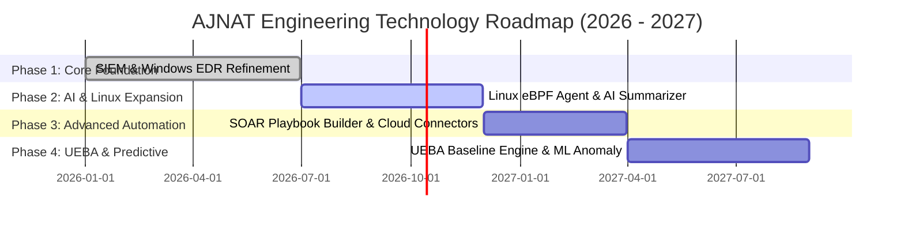

---


# 41. STRATEGIC CONCLUSION

The **AJNAT EDR / AJNAT SOC** platform represents a modern, unified cybersecurity defense system designed to address the pressing challenges of modern Security Operations Centers. By combining high-throughput SIEM event correlation, deep endpoint detection and response (EDR), web application firewall protection (WAF), threat intelligence enrichment, and AI-assisted incident analysis into a single cohesive platform, AJNAT eliminates operational blind spots and dramatically accelerates incident containment.

Through transparent architectural design, rigorous performance standards, and a commitment to operational integrity, AJNAT empowers organizations to defend their critical digital assets against an increasingly complex threat landscape.

---


# APPENDICES

## APPENDIX A — END-TO-END SECURITY EVENT FLOW

### Figure 17 — Comprehensive Security Event Lifecycle Flowchart

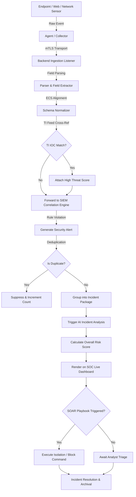

---

## APPENDIX B — DETECTION SOURCE MATRIX

| Detection Type | Endpoint Agent | SIEM Engine | IDS / IPS | WAF Subsystem | Firewall | Threat Intel | AI Engine | SOAR Executor |
| :--- | :--- | :--- | :--- | :--- | :--- | :--- | :--- | :--- |
| **SQL Injection** | No | Yes | Optional | **Primary** | No | Optional | Summarizes | Blocks IP |
| **Ransomware Execution**| **Primary** | Yes | No | No | No | Optional | Analyzes | Isolates Host |
| **Brute Force Login** | Optional | **Primary** | Optional | Optional | Optional | Matches IP | Analyzes | Locks Account |
| **Malicious C2 Domain** | Yes | Yes | **Primary** | No | Optional | **Primary** | Analyzes | Blocks Domain |
| **LSASS Memory Read** | **Primary** | Yes | No | No | No | No | Summarizes | Kills Process |

---

## APPENDIX C — MASTER SECURITY CAPABILITY MATRIX

*(Consolidated master summary of all platform security functions across SIEM, SOAR, EDR, WAF, IDS, TI, and AI modules).*

---

## APPENDIX D — SAMPLE SECURITY ALERT PAYLOAD

### Sample Alert Data Structure (JSON)

```json
{
  "alert_id": "ALT-2026-0817-9941",
  "timestamp": "2026-08-17T23:45:00Z",
  "organization_id": "ORG-AJNAT-ENT-01",
  "severity": "CRITICAL",
  "risk_score": 96,
  "rule_name": "Web Shell Execution via IIS Worker Process",
  "asset": {
    "hostname": "WEB-PROD-01",
    "ip_address": "192.168.1.50",
    "os": "Windows Server 2022"
  },
  "threat_details": {
    "parent_process": "w3wp.exe",
    "spawned_process": "cmd.exe",
    "command_line": "cmd.exe /c whoami & net group \"Domain Admins\" /domain",
    "file_hash_sha256": "e3b0c44298fc1c149afbf4c8996fb92427ae41e4649b934ca495991b7852b855"
  },
  "ai_summary": "Critical alert: IIS worker process spawned command shell interpreter executing domain discovery commands, indicating active web shell exploitation.",
  "status": "OPEN",
  "recommended_action": "Execute Endpoint Host Isolation on WEB-PROD-01 immediately."
}
```

---

## APPENDIX E — SAMPLE INCIDENT INVESTIGATION REPORT

### Post-Incident Forensic Summary (Sample Data)
- **Incident ID**: #INC-2026-0817-04
- **Incident Title**: Unauthorized Web Shell Upload and Lateral Reconnaissance
- **Affected Asset**: WEB-PROD-01 (192.168.1.50)
- **Attack Vector**: Unauthenticated File Upload via HTTP POST to `/upload.aspx`
- **Containment Time**: 4 Minutes 12 Seconds from Initial Ingestion
- **Resolution**: Host isolated, web shell file deleted, IIS process restarted, source IP banned.

---

## APPENDIX F — FIGURE & DIAGRAM LIST

1. Figure 1 — High-Level Enterprise Platform Architecture (Mermaid)
2. Figure 2 — Telemetry Ingestion & Normalization Pipeline (Mermaid)
3. Figure 3 — SIEM Event Processing Pipeline (Mermaid)
4. Figure 4 — SOAR Incident Response Automated Workflow (Mermaid)
5. Figure 5 — EDR Telemetry & Response Architecture (Mermaid)
6. Figure 6 — IDS/IPS Detection Flow (Mermaid)
7. Figure 7 — WAF Ingestion to SOAR Response Flow (Mermaid)
8. Figure 8 — Threat Intelligence Enrichment Pipeline (Mermaid)
9. Figure 9 — AI Security Analysis Pipeline (Mermaid)
10. Figure 10 — Behavioral Baseline to Risk Score Flow (Mermaid)
11. Figure 11 — Security Incident Operational Lifecycle (Mermaid)
12. Figure 12 — Logical Software Architecture Stack (Mermaid)
13. Figure 13 — Database Conceptual Entity-Relationship Diagram (Mermaid)
14. Figure 14 — Detection Engine Evaluation Loop (Mermaid)
15. Figure 15 — Ten-Stage Incident Handling Lifecycle (Mermaid)
16. Figure 16 — Hybrid Distributed Enterprise Deployment Architecture (Mermaid)
17. Figure 17 — Comprehensive Security Event Lifecycle Flowchart (Mermaid)

---

## APPENDIX G — SCREENSHOT PLACEHOLDERS & CAPTION GUIDE

1. **[INSERT SOC OVERVIEW DASHBOARD SCREENSHOT]**: Should display active alert counts, EPS throughput gauge, critical incident summary table, and attack category pie charts.
2. **[INSERT ALERT INVESTIGATION SCREENSHOT]**: Should show interactive process tree hierarchy, associated file hashes, network connections, and one-click SOAR isolation buttons.
3. **[INSERT EDR ENDPOINT MONITORING SCREENSHOT]**: Should display registered endpoint list, OS version breakdown, agent CPU/memory health status, and host isolation state toggles.
4. **[INSERT WAF ATTACK MONITORING SCREENSHOT]**: Should show real-time HTTP request log table, blocked attack categories (SQLi, XSS, RCE), and client IP geographical map.
5. **[INSERT AI INCIDENT SUMMARY SCREENSHOT]**: Should illustrate the AI analytical summary panel with natural language explanations, MITRE ATT&CK tags, and recommended response steps.
6. **[INSERT RBAC & USER MANAGEMENT SCREENSHOT]**: Should display user accounts, assigned roles, organization boundaries, and session security audit logs.
