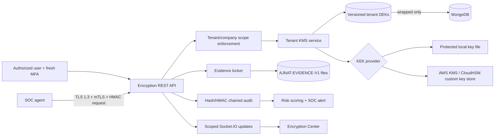
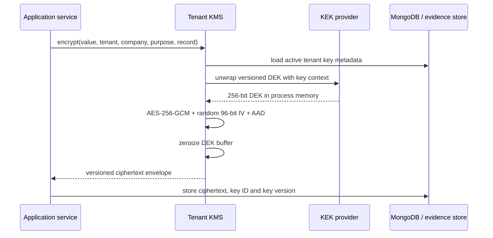
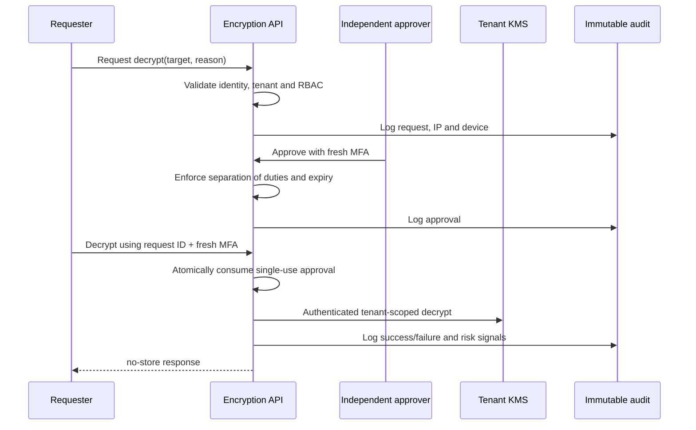

# AJNAT SOC Enterprise Encryption Framework

Version: 1.0  
Last updated: 2026-08-25  
Classification: Confidential / Proprietary  
Owner: AJNAT SOC Security Engineering

## 1. Purpose and security boundary

This document defines the implemented encryption controls for the existing AJNAT multi-tenant SOC platform. It is an implementation and operations guide, not a claim that infrastructure outside this repository is already compliant. Production acceptance requires the deployment checks and validation gates in this document.

The framework protects tenant secrets, selected sensitive database records, TOTP secrets, SOAR credentials, forensic evidence, backup files and agent transport. It uses envelope encryption so data-encryption keys (DEKs) can rotate without placing plaintext key material in MongoDB.

## 2. Architecture

### Envelope encryption

AAD binds ciphertext to `tenantId`, `companyId`, purpose and record ID. Moving a valid ciphertext to another tenant, company, record or purpose causes authentication failure.

## 3. Cryptographic profile

| Control | Implementation |
|---|---|
| Primary encryption | AES-256-GCM |
| GCM nonce | 96 random bits per operation from the OS CSPRNG |
| GCM tag | 128 bits |
| Hashes | SHA-256 and SHA-512 |
| Audit/message MAC | HMAC-SHA256 |
| Password hashing | Argon2id; successful legacy bcrypt logins are rehashed |
| Password-based derivation | PBKDF2-HMAC-SHA512, minimum 310,000 iterations; default 600,000 |
| Public-key validation | RSA-4096/PSS/SHA-512 and ECDSA/SHA-512 |
| Transport | TLS 1.3 direct mode, or a separately controlled trusted TLS proxy |
| Agent authentication | mTLS certificate validation/pinning plus timestamped HMAC requests and replay nonce |

MD5, SHA-1, DES, 3DES, RC4, ECB mode, static nonces and hardcoded production keys are not used by this framework.

This code uses the cryptographic provider shipped with Node.js. A FIPS claim is permitted only when the operating system, Node/OpenSSL build and KMS/HSM provider have been deployed and independently validated in FIPS mode.

## 4. Key hierarchy and isolation

- One active, randomly generated 256-bit DEK exists per tenant.
- Previous DEKs are retained in wrapped form so historical ciphertext remains readable.
- Each key has a random key ID, monotonically increasing version, activation date, expiry date and lifecycle state.
- Tenant and company identifiers are cryptographically bound through AAD.
- The local provider wraps DEKs using an AES-256-GCM KEK read from a protected file.
- The AWS provider delegates DEK wrapping to AWS KMS and supports a CloudHSM-backed KMS key.
- Plaintext KEKs and DEKs are never stored in MongoDB. Buffers are overwritten after use on a best-effort basis.
- JavaScript garbage collection prevents a guarantee that every runtime copy is instantly zeroized; use process isolation and an HSM/KMS when that assurance is required.

### Key lifecycle

`active -> retired -> revoked`

New keys receive the configured expiry period. The designated background scheduler checks active keys hourly by default and rotates keys entering the seven-day pre-expiry window. Manual creation, rotation and revocation require cryptographic RBAC plus recent MFA. Active keys must be rotated before revocation.

Rotation changes the DEK for new writes. It does not rewrite historical ciphertext immediately. Historical data continues to reference its key ID/version. Revocation deliberately makes affected ciphertext unavailable; the incident and legal consequences must be approved before revocation.

## 5. Key providers and key ceremony

### Protected local-file provider

1. On an isolated administration host, generate 32 random bytes using an approved CSPRNG.
2. Base64-encode the bytes and place the value in the secret file referenced by `KMS_MASTER_KEY_FILE`.
3. Set ownership to the backend service account and permissions to `0600` or stricter.
4. Generate an independent audit HMAC secret in `ENCRYPTION_AUDIT_KEY_FILE`.
5. Back up both files into an approved offline secret escrow. Never place either file in Git, an image layer, logs or ordinary backups.
6. Record two-person custody, creation time, cryptoperiod, escrow location and recovery test.

Production refuses an environment-only local KEK. `KMS_MASTER_KEY_B64` and `ENCRYPTION_AUDIT_KEY` exist only for development/test compatibility.

In non-production environments, if the configured secret mount is absent and
`KMS_MASTER_KEY_B64` is not set, the local provider creates a persistent `0600`
development key under `backend/.runtime-secrets/`. This directory is ignored by
Git. Production never uses this fallback and still requires the configured
secret file.

### AWS KMS / HSM provider

Configure `KMS_PROVIDER=aws-kms`, `AWS_KMS_KEY_ID` and the region. Grant the workload identity only `kms:Encrypt`, `kms:Decrypt` and `kms:DescribeKey` for the configured key and required encryption context. The health endpoint performs a real `DescribeKey` check and caches its result briefly. CloudTrail, key deletion protection, multi-region recovery and CloudHSM custom key-store controls are deployment responsibilities.

## 6. Sensitive database records

`SecureRecord` stores API keys, OAuth/refresh tokens, SMTP and LDAP credentials, threat-intelligence keys, cloud credentials, policies, customer secrets, tenant metadata, investigation notes, IOC collections, case data and configuration payloads as tenant envelopes. Ciphertext is excluded from normal queries and JSON serialization.

The implemented rolling migration covers legacy TOTP secrets and legacy SOAR vault credentials. It is idempotent and clears legacy values only after the encrypted replacement has saved successfully.

Important: existing arbitrary legacy model fields are not automatically encrypted merely because the framework exists. Before production sign-off, every legacy source listed in the data inventory must either be migrated to `SecureRecord`, receive an explicit encrypted envelope field, or be protected with a reviewed MongoDB client-side field-encryption design. Indexed and correlated fields must not be transparently encrypted without query-impact testing.

## 7. Evidence locker

The evidence workflow is:

`upload -> SHA-256 -> chunked AES-256-GCM -> secured file -> ciphertext SHA-256 -> custody/audit record -> approval -> verified decryption`

`AJNAT-EVIDENCE-V1` uses independently authenticated chunks, a unique random nonce per chunk and AAD containing tenant, company, evidence ID, chunk index and clear length. This supports bounded memory use for large PCAPs, dumps, images, hives, logs, malware samples and archives.

Encryption jobs persist byte, chunk and output offsets. Jobs interrupted by a process restart are resumed from the last committed frame, with the output truncated to the committed boundary. Plaintext upload staging is removed after completion or failure. The evidence file's ciphertext SHA-256 is verified before an approval is consumed or plaintext is returned.

The evidence volume must use restricted service-account permissions and encrypted storage. Antivirus or EDR must not execute quarantined malware. Malware samples should additionally be isolated by storage policy and content disposition.

## 8. Controlled decryption

The requester must be the user named on the approval. Requests expire, are single use and are atomically consumed. Self-approval is disabled unless an explicit emergency configuration override is set. Every attempt records actor, role, tenant/company, target, timestamp, source IP, user agent, reason and outcome.

Role mapping in the current product:

| Security duty | Platform role | Access |
|---|---|---|
| Platform authority | `superadmin` | Cross-tenant only when an explicit valid scope is supplied; key administration and approval |
| Security administrator | `soc_manager` | Tenant/company key administration and approval |
| Company administrator | `company_admin` | Own-company encrypt/decrypt request/decrypt; cannot approve |
| Incident responder | `l3_analyst` | Own authorized company encrypt/decrypt |
| Digital forensics analyst | `l4_analyst` | Own authorized company evidence encrypt/decrypt |
| Tier-2 analyst | `l2_analyst` | View/request/decrypt after approval |

## 9. Immutable audit and AI risk analytics

Encryption audit rows are append-only at the Mongoose model boundary. Each tenant has a monotonic sequence. Every row contains the previous row hash, a SHA-256 entry hash and an HMAC-SHA256 signature under an independent audit key. The verification API detects mutation, deletion, reordering and insertion within the retained chain.

Risk scoring detects failed/denied decryptions, repeated recent failures, cross-tenant decryption patterns and sensitive revoke/export operations. High-risk activity creates a normal SOC alert so existing triage, correlation and SOAR workflows can respond.

For stronger immutability, production must also enable MongoDB authorization that denies update/delete on the audit collection, database auditing, write-once archival and off-platform signed head-hash anchoring. Application hooks alone do not protect against a database administrator.

## 10. Transport security

Direct backend TLS mode enforces TLS 1.3 as the minimum. Agent routes can require a CA-validated client certificate and compare the presented SHA-256 fingerprint with the enrolled system identity. Each request also uses an HMAC-SHA256 signature, timestamp, nonce and replay store.

Agents use a pooled validated HTTPS session, optional private CA bundle, client certificate/private key and optional server certificate SHA-256 pin. Plain HTTP is rejected when TLS is required.

Certificate enrollment, CA signing, revocation distribution and automatic renewal are not implemented by this repository version. They must be supplied by an enterprise PKI/MDM workflow before `renewal_managed` can be reported as true. Do not distribute a CA private key in an agent bundle.

When a reverse proxy terminates TLS/mTLS, restrict the backend listener to the proxy network, strip client-supplied certificate headers and configure `TRUSTED_TLS_PROXY`/`AGENT_MTLS_AT_PROXY` only after the proxy validation path has been tested.

## 11. REST API

Base path: `/api/encryption`. All routes require JWT authentication and per-user/path rate limiting.

| Method and path | Purpose | Additional control |
|---|---|---|
| `GET /overview` | Health, counts and trends | View permission |
| `GET /keys` | Public key metadata inventory | View permission |
| `POST /keys` | Create first tenant DEK | Key-manage + fresh MFA |
| `POST /keys/rotate` | Rotate active DEK | Key-manage + fresh MFA |
| `POST /keys/:keyId/revoke` | Revoke retired DEK | Key-manage + fresh MFA + reason |
| `POST /records/encrypt` | Create encrypted secure record | Encrypt permission |
| `GET /records` | List metadata (never ciphertext/plaintext) | View permission |
| `POST /decrypt/requests` | Request controlled access | Request permission + reason |
| `POST /decrypt/requests/:id/decision` | Approve/deny | Approver + fresh MFA + separation of duties |
| `POST /records/:id/decrypt` | Single-use record decryption | Decrypt + fresh MFA + approval |
| `POST /evidence` | Queue streamed evidence encryption | Encrypt permission |
| `GET /evidence/:id/decrypt` | Verified evidence download | Decrypt + fresh MFA + approval |
| `GET /jobs` | Recent crypto jobs | View permission |
| `GET /audit` | Audit records or CSV export | View; export permission for CSV |
| `POST /audit/verify` | Verify tenant hash chain | Key-manage + fresh MFA |
| `POST /hash` | SHA-256/SHA-512 digest | Encrypt permission |
| `POST /integrity/verify` | Compare SHA-256 | View permission |
| `POST /signatures/validate` | RSA-PSS/ECDSA verification | View permission |

## 12. Dashboard

The company/SOC React application exposes `/encryption` with status cards, 30-day activity, key inventory, job state, decryption approvals and immutable audit activity. Socket.IO events refresh key, job and approval state. Key material and plaintext never appear in dashboard responses.

The separate superadmin frontend does not yet have a dedicated Encryption Center page. Superadmins can use the authenticated API, but UI parity is a release prerequisite if the operations team requires it.

## 13. Backup and recovery

`npm run encrypt:backup -- <companyId> <input> <output>` creates a chunked AES-256-GCM backup plus a restricted manifest containing key ID/version and integrity hashes. `npm run decrypt:backup -- <encrypted> <manifest> <new-output>` verifies encrypted and plaintext integrity and refuses to overwrite an existing recovery target.

Recovery prerequisites are the encrypted data, MongoDB key metadata and access to the same KEK/KMS key. Losing any one permanently destroys recoverability. Quarterly recovery exercises must use an isolated environment and record RTO/RPO, hash verification and custody.

Do not treat ordinary backup of the local KEK as sufficient. Use two-person secret escrow, separate failure domains and tested restoration. AWS KMS deployments must document key-region recovery and deletion waiting periods.

## 14. Production configuration

Start from `backend/.env.encryption.example`. Actual keys and certificates belong in a root/service-account protected secret mount or workload identity. Production startup fails closed when TLS/mTLS/KMS/audit controls are absent.

Required deployment controls:

1. Mount KEK and audit key read-only with least privilege, or configure AWS KMS workload identity.
2. Set TLS 1.3 certificate, private key and agent CA paths, or harden and attest the trusted proxy path.
3. Set every production agent to `require_tls=true` and deploy its unique client identity securely.
4. Put `secure-data` on a dedicated encrypted filesystem; deny web-server static access.
5. Apply MongoDB least privilege and encrypted storage, and block direct client access.
6. Configure centralized log redaction so secrets, authorization headers and decrypted payloads never enter logs.
7. Disable core dumps for processes handling plaintext and restrict debugging/ptrace.
8. Monitor KMS health, key expiry, failed decryption alerts, job backlog and disk capacity.

## 15. Migration procedure

1. Inventory every secret-bearing legacy field and take a tested encrypted backup.
2. Deploy code with KMS configured but do not expose key-management routes publicly.
3. Run `npm run migrate:encryption` once per environment.
4. Verify TOTP login and SOAR connector operation for several tenants.
5. Re-run the migration; expected migrated counts are zero.
6. Query for remaining legacy TOTP/SOAR ciphertext fields and investigate any residue.
7. Move remaining sensitive legacy domains through a separately reviewed migration.
8. Rotate the tenant key after migration and verify old/new ciphertext decryption.
9. Retain rollback backups until the acceptance window closes.

Never delete a legacy field before validating that its new envelope authenticates and decrypts under the correct tenant/company context.

## 16. Validation and release gates

Automated checks currently cover AES round trips, unique IVs, AAD isolation, ciphertext/tag tampering, PBKDF2 policy, SHA/HMAC, RSA-4096, ECC, local KEK wrapping, RBAC denial, Argon2id/bcrypt migration, chunked evidence round trip/tampering, agent TLS refusal and secure-file/spool behavior.

Mandatory pre-production gates:

- Run the complete backend and frontend suites on a clean CI checkout.
- Run MongoDB replica-set integration tests for concurrent audit appends and key rotation.
- Test multi-gigabyte evidence interruption/resume, out-of-space handling and cleanup.
- Test AWS KMS/CloudHSM outage, throttling, disabled key and recovery behavior.
- Complete mTLS enrollment, renewal and revocation validation with the selected enterprise PKI.
- Complete the legacy sensitive-field inventory and migration.
- Perform authorization/tenant-isolation penetration testing and dependency remediation.
- Validate backup recovery and audit-chain anchoring.
- Validate the exact FIPS boundary before making a FIPS compliance claim.

## 17. Current implementation status

| Capability | Status |
|---|---|
| AES-256-GCM primitives and envelope encryption | Implemented and unit tested |
| Per-tenant versioned DEKs and company-bound AAD | Implemented |
| Local protected-file KEK / AWS KMS | Implemented; live AWS validation deployment-dependent |
| Manual and scheduled key rotation | Implemented |
| Key revocation | Implemented |
| Evidence streaming, integrity and resume checkpoints | Implemented; large-scale recovery test pending |
| Controlled decrypt approval, MFA, RBAC and audit | Implemented |
| Immutable application audit and risk alerts | Implemented; external WORM anchoring pending |
| TOTP and SOAR secret migration | Implemented |
| All legacy database fields encrypted | Not complete; requires data-inventory migration |
| Backup encryption/recovery utilities | Implemented; disaster-recovery exercise pending |
| TLS 1.3 and agent mTLS validation/pinning | Implemented when configured |
| Automatic certificate enrollment/renewal/revocation | Not implemented; enterprise PKI integration required |
| Company/SOC Encryption Center | Implemented |
| Superadmin Encryption Center parity | Not implemented |
| AI crypto-usage anomaly scoring | Implemented rule/risk engine; trained ML model not claimed |
| FIPS certification | Deployment/provider validation required |

The “not complete” items are release gates, not silent fallbacks. They must remain visible in security review and product status until verified.
